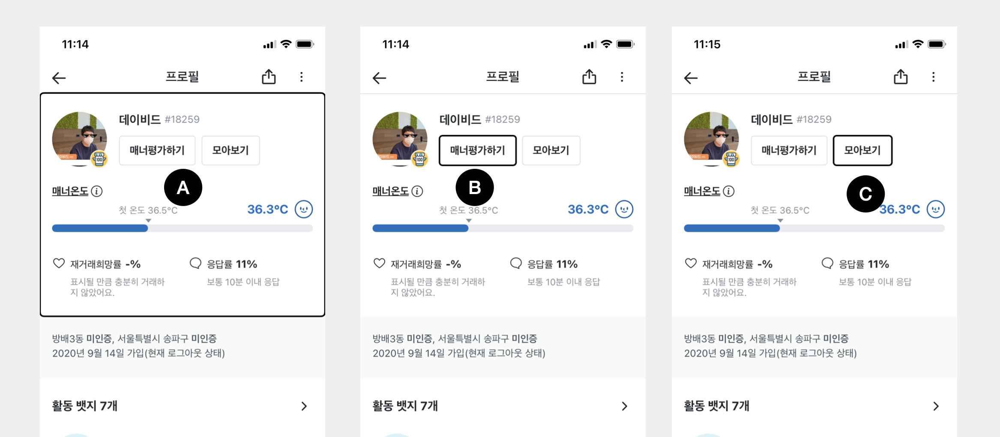
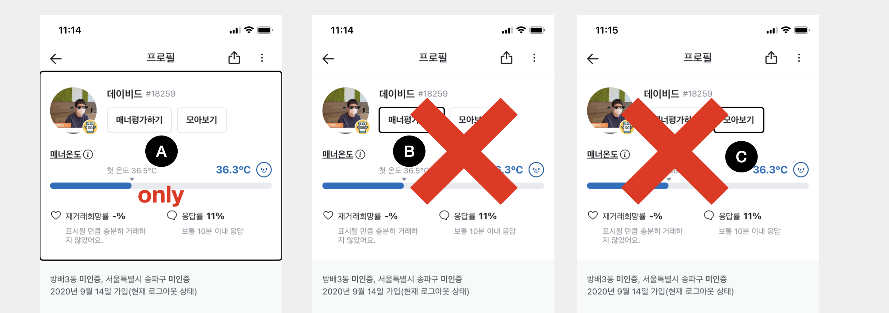

# Accessibility

## 개요

Texture에서의 접근성 적용방법은 기존 UIKit와 큰 차이는 없으며, ASButtonNode, ASTextNode 등 내부적으로 접근성에 대한 기능을 제공하고 있습니다. 자세한 내용은 [Apple 가이드 문서](https://developer.apple.com/accessibility/ios/) 참고하시길 바랍니다.

```swift

//Focus Engine

extension ASDisplayNode {

    
    // Accessibility support
    open var isAccessibilityElement: Bool

    open var accessibilityLabel: String?

    @available(iOS 11.0, *)
    @NSCopying open var accessibilityAttributedLabel: NSAttributedString?

    open var accessibilityHint: String?

    @available(iOS 11.0, *)
    @NSCopying open var accessibilityAttributedHint: NSAttributedString?

    open var accessibilityValue: String?

    @available(iOS 11.0, *)
    @NSCopying open var accessibilityAttributedValue: NSAttributedString?

    open var accessibilityTraits: UIAccessibilityTraits

    open var accessibilityFrame: CGRect

    @NSCopying open var accessibilityPath: UIBezierPath?

    open var accessibilityActivationPoint: CGPoint

    open var accessibilityLanguage: String?

    open var accessibilityElementsHidden: Bool

    open var accessibilityViewIsModal: Bool

    open var shouldGroupAccessibilityChildren: Bool

    open var accessibilityNavigationStyle: UIAccessibilityNavigationStyle

    @available(iOS 8.0, *)
    open var accessibilityCustomActions: [Any]?

    
    // Accessibility identification support
    open var accessibilityIdentifier: String?
}
```

### 내부 구현체 예

#### ASTextNode.mm setAttributedText

```objectivec
- (void)setAttributedText:(NSAttributedString *)attributedText

 /** ~~~ 생략 ~~~ **/
 
  // Accessiblity
  const auto currentAttributedText = self.attributedText; // Grab attributed string again in case it changed in the meantime
  self.accessibilityLabel = self.defaultAccessibilityLabel;
  
  // We update the isAccessibilityElement setting if this node is not switching between strings.
  if (oldAttributedText.length == 0 || currentAttributedText.length == 0) {
    // We're an accessibility element by default if there is a string.
    self.isAccessibilityElement = (currentAttributedText.length != 0);
  }
```

#### ASButtonNode.mm  defaultAccessibilityLabel & defaultAccessibilityTraits

```objectivec
- (NSString *)defaultAccessibilityLabel
{
  ASLockScopeSelf();
  return _titleNode.defaultAccessibilityLabel;
}

- (UIAccessibilityTraits)defaultAccessibilityTraits
{
  return self.enabled ? UIAccessibilityTraitButton
                      : (UIAccessibilityTraitButton | UIAccessibilityTraitNotEnabled);
}

```


### Quick Example



#### 목표 

* A 전체를 읽어주고 \(유저이름 + 매너온도 + 재거래 및 응답률\)
* 커서 이동에 따라서 B\(매너평가하기\)와 C\(모아보기\)를 클릭할 수 있음을 알려줍니다.

```swift
final class ProfileInfoNode: ASDisplayNode {

  let backgroundNode = ASDisplayNode()
  let usernameNode = ASTextNode()
  let mannerRateButtonNode = ASButtonNode()
  let watchButtonNode = ASButtonNode()
  ...

  func setupAccesibility() {
     self.backgroundNode.accessibilityLabel = "데이비드 매너온도 36.3  재거래희망률 ~~~"
     self.backgroundNode.isAccessibilityElement = true
     
     self.accessibilityElements = [
       self.backgroundNode,
       self.mannerRateButtonNode,
       self.watchButtonNode
     ]
  }

}
```

* backgroundNode\(ASDisplayNode\) 기본적으로 `isAccessibilityElement`가  disabled\(false\)상태입니다. 직접 `accessibilityLabel`를 넣고 enable함으로서 \[A\] 이미지와 같이 포커스를 줄 수 있습니다.
* ASButtonNode나 ASTextNode등 읽거나 클릭할 수 있는 Node에 내용물이 있는 경우 Texture 내부적으로 accesibility를 활성화합니다. 즉, `setAttributedText`나 `text`를 넣음과 동시에 `accessibilityLabel`이나 `traits`등이 기본값으로 지정됩니다.
* accessibilityElements index 0부터 시작해서 순차적으로 포커싱을 해줍니다. \(주로 순서를 지정합니다.\)


## Advenced

### isAccessibilityContainer

```objectivec
// ASDisplayNode+Beta.h

/**
 * @abstract Whether this node acts as an accessibility container. If set to YES, then this node's accessibility label will represent
 * an aggregation of all child nodes' accessibility labels. Nodes in this node's subtree that are also accessibility containers will
 * not be included in this aggregation, and will be exposed as separate accessibility elements to UIKit.
 */
@property BOOL isAccessibilityContainer;
```

부모에 isAccessibilityContainer를 활성화하는 경우 accessibility과 활성화된 자식노드들을 하나로 모아서 포커싱과 동시에 읽어줍니다.

#### 예

```swift
final class ProfileInfoNode: ASDisplayNode {

  let backgroundNode = ASDisplayNode()
  let usernameNode = ASTextNode()
  let mannerRateButtonNode = ASButtonNode()
  let watchButtonNode = ASButtonNode()
  ...
  
  override init() {
    super.init()
    self.isAccessibilityContainer = true // 활성
  }

  func setupAccesibility() {
     self.backgroundNode.accessibilityLabel = "데이비드 매너온도 36.3  재거래희망률 ~~~"
     self.backgroundNode.isAccessibilityElement = true
     
     self.accessibilityElements = [
       self.backgroundNode,
       self.mannerRateButtonNode,
       self.watchButtonNode
     ]
  }

}
```

#### output: 



* A만 포커싱되면서 B, C는 포커싱 되지 않습니다.

```swift
"데이비드 매너온도 36.3  재거래희망률 ~~~ 매너평가하기 모아보기"
```


## 도움되는 사이트

* [https://developer.apple.com/accessibility/ios/](https://developer.apple.com/accessibility/ios/)
* [https://a11y-guidelines.orange.com/en/mobile/ios/development/](https://a11y-guidelines.orange.com/en/mobile/ios/development/)

