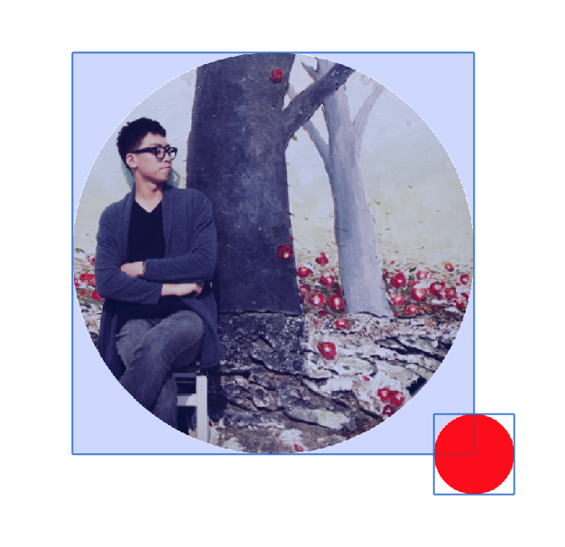
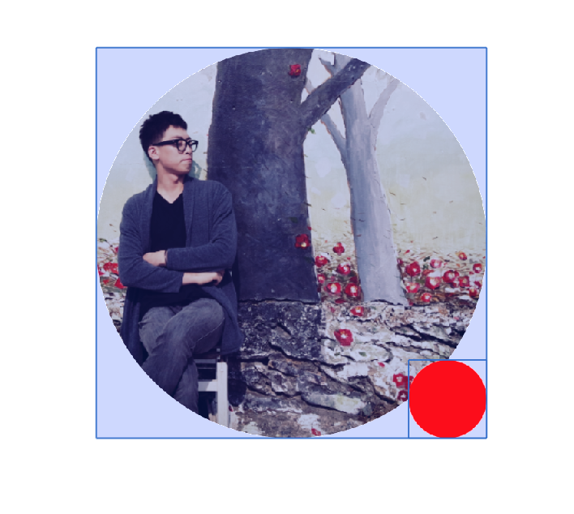
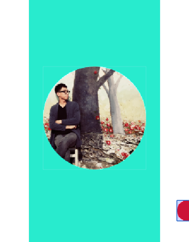

# LayoutSpecs

## 1. ASWrapperLayoutSpec

ASLayoutElement를 Wrapping하며,  ASLayoutSpec중 가장 기본적이고 간단한 Subclass 입니다.

상위 레이아웃에서 정의된 constrainedSize\(ASSizeRange\)를 기반으로 Wrapping된 사이즈를 계산합니다. 

따라서 기본적인 **단일 Layout을 반환**하는데 사용하는것이 **이상적**입니다. 

단, layout에 대한 postion\(CGPoint\) 값이 적용되어야할 경우 **ASAbsoluteLayoutSpec**사용해야합니다. 


### 사용법 

```swift
override func layoutSpecThatFits(_ constrainedSize: ASSizeRange) -> ASLayoutSpec {
    return ASWrapperLayoutSpec.init(layoutElement: childNode1)
}
```

부모에서 전달된 **constrainedSize**가 375pt x 812pt 일 때 **calculatedLayoutThatFits**를 통해서 사이즈를 계산하면 childNode를 wrapping한 layout size가 부모의 사이즈와 동일하게 계산되는 것을 확인 하 실 수가 있습니다. 

```bash
po ASWrapperLayoutSpec.init(layoutElement: childNode1).calculateLayoutThatFits(constrainedSize)
<ASLayout: 0x600002137700; size = {375, 812}>
```

_Wrapping되는 child element에 preferredSize를 적용하더라도 의미가 없습니다._ 

```swift
override func layoutSpecThatFits(_ constrainedSize: ASSizeRange) -> ASLayoutSpec {
    childNode1.style.preferredSize = .init(width: 100.0, height:100.0) // 의미없음 
    return ASWrapperLayoutSpec.init(layoutElement: childNode1)
}
```

단일 노드 뿐만 아니라 Array형태로 elements를 받아서 처리할 수도 있습니다. 

```swift
override func layoutSpecThatFits(_ constrainedSize: ASSizeRange) -> ASLayoutSpec {
    return ASWrapperLayoutSpec.init(layoutElements: [childNode1, childNode2])
}
```


### 요점 정리 

* 단일 노드 반환에 이상적
* position이 필요한 경우 ASAbsoluteLayoutSpec사용 할 것

## 2. ASInsetLayoutSpec

child element에 inset값을 적용 시켜주는 LayoutSpec입니다. 

```swift
ASInsetLayoutSpec.init(insets: UIEdgeInsets, child: ASLayoutElement)
```

ASInsetLayoutSpec은 constrainedSize.max size 값을 자식에게 전달해주며 전달된 값을 정의된 insets값에 따라 자식의 margin을 더해줍니다. 


### 사용법

```swift
override func layoutSpecThatFits(_ constrainedSize: ASSizeRange) -> ASLayoutSpec {
    let insets: UIEdgeInsets = .init(top: 50.0, left: 50.0, bottom: 50.0, right: 50.0)
    return ASInsetLayoutSpec.init(insets: insets, child: childNode1)
}
```

insets의  top, left, bottom, right에 inifinity를 지정하게 되면 자식노드의 instrinsic size로 결정됩니다. 

```swift
override func layoutSpecThatFits(_ constrainedSize: ASSizeRange) -> ASLayoutSpec {
    let insets: UIEdgeInsets = .init(top: .infinity, left: 50.0, bottom: .infinity, right: 50.0)
    childNode1.style.height = .init(unit: .points, value: 100.0)
    let insetLayout = ASInsetLayoutSpec.init(insets: insets, child: childNode1)
    
    // ...
}
```


즉, 다시 말하자면 child element의 크기에 따라 ASInsetLayoutSpec의 크기가 결정되기 때문에 ASInsetLayoutSpec가 사이즈를 가지기 위해서 본질적인 사이즈 또는 계산에 따른 사이즈가 설정 되어야합니다. 

### 요점 정리 

* insets값은 child element의 margin값을 정의
* ASInsetLayoutSpec가 사이즈를 가지기 위해서 본질적인 사이즈 또는 계산에 따른 사이즈가 설정 되어야합니다. 

## 3. ASStackLayoutSpec

Texture에서 제공해주는 다양한 LayoutSpec중 가장 유용하고 강력한 LayoutSpec 입니다. 

**Flexbox**는 다양한 화면 크기에서 **일관된 레이아웃을 제공**하도록 설계되어 있으며, Flexbox를 기반으로 child layout element의 위치와 크기를 결정합니다. 

해당 레이아웃에서는 child layout element들에 대해서 세로 또는 가로 스택으로 정렬합니다.

Stack Layout은 다른 Stack Layout의 child layout element가 될 수 있으므로 ASStackLayoutSpec에서 제공해주는 모든 기능을 사용하여 **거의 모든 레이아웃을 만들 수 있습니다.**

ASStackLayoutSpec은 총 3가지의 convenience initialization를 제공합니다.

```swift
ASStackLayoutSpec.init(direction: ASStackLayoutDirection,
                       spacing: CGFloat,
                       justifyContent: ASStackLayoutJustifyContent,
                       alignItems: ASStackLayoutAlignItems,
                       children: [ASLayoutElement])
                      
// basic + flexWrap & alignContent  
ASStackLayoutSpec.init(direction: ASStackLayoutDirection,
                       spacing: CGFloat,
                       justifyContent: ASStackLayoutJustifyContent,
                       alignItems: ASStackLayoutAlignItems,
                       flexWrap: ASStackLayoutFlexWrap,
                       alignContent: ASStackLayoutAlignContent,
                       children: [ASLayoutElement])   

// basic + flexWrap & alignContent + lineSpacing                     
ASStackLayoutSpec.init(direction: ASStackLayoutDirection,
                       spacing: CGFloat,
                       justifyContent: ASStackLayoutJustifyContent,
                       alignItems: ASStackLayoutAlignItems,
                       flexWrap: ASStackLayoutFlexWrap,
                       alignContent: ASStackLayoutAlignContent,
                       lineSpacing: CGFloat,
                       children: [ASLayoutElement])         
```

<table>
  <thead>
    <tr>
      <th style="text-align:left">Parameter</th>
      <th style="text-align:left">Type</th>
      <th style="text-align:left">Description</th>
    </tr>
  </thead>
  <tbody>
    <tr>
      <td style="text-align:left">direction</td>
      <td style="text-align:left">ASStackLayoutDirection</td>
      <td style="text-align:left">
        <p>child layout elements&#xC5D0; &#xB300;&#xD574;&#xC11C; &#xC21C;&#xCC28;&#xC801;&#xC73C;&#xB85C;
          &#xC313;&#xB294; &#xBC29;&#xD5A5;&#xC744; &#xC9C0;&#xC815;&#xD569;&#xB2C8;&#xB2E4;.
          horizontalAlignment(<b>.horizontal</b>) &#xB610;&#xB294; verticalAlignment(<b>.vertical</b>)
          &#xC124;&#xC815;&#xC5D0; &#xB530;&#xB77C;&#xC11C; justifyContent &#xBC0F;
          alignItems&#xAC00; &#xC801;&#xC808;&#xD558;&#xAC8C; &#xAC31;&#xC2E0;&#xB429;&#xB2C8;&#xB2E4;.</p>
        <p>(default: .horizontal)</p>
      </td>
    </tr>
    <tr>
      <td style="text-align:left">spacing</td>
      <td style="text-align:left">CGFloat</td>
      <td style="text-align:left">
        <p>child layout elements &#xAC04;&#xC758; &#xADE0;&#xB4F1;&#xD55C; &#xC0AC;&#xC774;&#xAC04;&#xACA9;&#xC744;
          &#xC9C0;&#xC815;&#xD569;&#xB2C8;&#xB2E4;.</p>
        <p>(default: 0.0)</p>
      </td>
    </tr>
    <tr>
      <td style="text-align:left"><a href="https://app.gitbook.com/@texture-kr/s/wiki/newbie-guide/flex-box#1-justifycontent">justifyContent</a>
      </td>
      <td style="text-align:left">ASStackLayoutJustifyContent</td>
      <td style="text-align:left">
        <p>&#xC8FC;&#xCD95;&#xC744; &#xB530;&#xB978; &#xC815;&#xB82C;&#xBC29;&#xBC95;&#xC744;
          &#xC815;&#xC758;&#xD569;&#xB2C8;&#xB2E4;.</p>
        <p>(default: .start)</p>
      </td>
    </tr>
    <tr>
      <td style="text-align:left">alignItems</td>
      <td style="text-align:left">ASStackLayoutAlignItems</td>
      <td style="text-align:left">
        <p>&#xAD50;&#xCC28; &#xCD95;&#xC744; &#xB530;&#xB77C; &#xC815;&#xB82C;&#xB41C;
          child layout elements&#xB4E4;&#xC758; orientation&#xC744; &#xC9C0;&#xC815;&#xD569;&#xB2C8;&#xB2E4;.</p>
        <p>(default: .stretch)</p>
      </td>
    </tr>
    <tr>
      <td style="text-align:left">flexWrap</td>
      <td style="text-align:left">ASStackLayoutFlexWrap</td>
      <td style="text-align:left">
        <p>child layout elements&#xAC00; &#xD55C; &#xC904;(<b>noWrap</b>) &#xB610;&#xB294;
          &#xC5EC;&#xB7EC; &#xC904;(<b>wrap</b>)&#xB85C; &#xC313;&#xC5EC;&#xC57C;&#xD558;&#xB294;
          &#xC9C0; &#xC9C0;&#xC815;&#xD569;&#xB2C8;&#xB2E4;.</p>
        <p>(default: .noWrap)</p>
      </td>
    </tr>
    <tr>
      <td style="text-align:left">alignContent</td>
      <td style="text-align:left">ASStackLayoutAlignContent</td>
      <td style="text-align:left">
        <p>&#xC5EC;&#xB7EC; &#xAC1C;&#xC758; &#xC120;&#xC774;&#xC788;&#xB294; &#xACBD;&#xC6B0;
          &#xAD50;&#xCC28; &#xCD95;&#xC744; &#xB530;&#xB77C; &#xC120;&#xC758; &#xBC29;&#xD5A5;&#xC744;
          &#xC815;&#xD569;&#xB2C8;&#xB2E4;.</p>
        <p>(default: .start)</p>
      </td>
    </tr>
    <tr>
      <td style="text-align:left">lineSpacing</td>
      <td style="text-align:left">CGFloat</td>
      <td style="text-align:left">
        <p>&#xC5EC;&#xB7EC; &#xC120;&#xAC04;&#xC758; &#xAC04;&#xACA9;&#xC744; &#xC9C0;&#xC815;&#xD569;&#xB2C8;&#xB2E4;.</p>
        <p>(default: 0.0)</p>
      </td>
    </tr>
    <tr>
      <td style="text-align:left">children</td>
      <td style="text-align:left">Array&lt;ASLayoutElement&gt;</td>
      <td style="text-align:left">
        <p>stackLayout&#xC5D0; &#xC313;&#xC774;&#xB294; child layout elements &#xC758;&#xBBF8;&#xD569;&#xB2C8;&#xB2E4;.</p>
        <p>(default: nil)</p>
      </td>
    </tr>
  </tbody>
</table>### 사용법

* ASStackLayoutSpec elements properties는 [여기](https://app.gitbook.com/@texture-kr/s/wiki/layout-api/layout-element-properties#3-stack-layout-element-properties-asstacklayoutelement)를 참고해주세요.
* Flexbox 를 활용방법은 [여기](https://app.gitbook.com/@texture-kr/s/wiki/newbie-guide/flex-box)를 참고해주세요. 

```swift
override func layoutSpecThatFits(_ constrainedSize: ASSizeRange) -> ASLayoutSpec {

    childNode1.style.flexShrink = 1.0
    childNode1.style.flexGrow = 0.0
    
    childNode2.style.flexShrink = 1.0
    childNode2.style.flexGrow = 1.0    

    let stackLayout = ASStackLayoutSpec.init(direction: .horizontal,
                                             spacing: 20.0,
                                             justifyContent: .start,
                                             alignItems: .stretch,
                                             children: [childNode1, childNode2])
    // ...
}
```


### 요점정리

* 적절히 ASStackLayoutSpec elements properties 과 Flexbox properties 활용하여 설계합니다. 
* 거의 왠만한 Layout은 ASStackLayoutSpec으로 설계 할 수 있습니다. 


## 4. ASOverlayLayoutSpec

명칭 그대로 Overlay 해주는 LayoutSpec으로써, 특정 Overlay 대상 노드를 특정 child 노드위에 Overlay시키는 LayoutSpec입니다. 

```swift
ASOverlayLayoutSpec.init(child: ASLayoutElement, overlay: ASLayoutElement)
```

최상단에 **overlay되는 대상은 overlay:** 에서 매개변수로 받으며 child: 에서 **overlay되는 대상을 자식으로 가지는 layout element**를 받습니다. 


### 사용법


```swift
override func layoutSpecThatFits(_ constrainedSize: ASSizeRange) -> ASLayoutSpec {
   let overlayLayout = ASOverlayLayoutSpec.init(child: blueNode, overlay: redNode)
   
   // ... 
}
```


### 요점 정리

*  크기에 대해서 임의로 조절하기 위해선 child에 해당하는 layout element는 반드시 본질적인 사이즈 또는 계산에 따른 사이즈가 설정 되어야합니다. 
* overlay에 해당하는 layout element는 child에서 계산된 constrainedSize값을 받아서 처리합니다. _\(즉, blueNode의 사이즈가 줄어들면 redNode의 사이즈도 같이 줄어들게 됩니다. \)_


## 5. ASBackgroundLayoutSpec

Background를 정의해주는 LayoutSpec입니다.

```swift
ASBackgroundLayoutSpec.init(child: ASLayoutElement, background: ASLayoutElement)
```

ASBackgroundLayoutSpec은 ASOverlayLayoutSpec과 비슷해보지만 큰 차이점이라면 background에 해당하는 layout element가 child에 해당하는 layout element의 사이즈에 영향을 받습니다. 

즉, background의 layout element의 사이즈는 child의 layout elements 사이즈에 의해 결정됩니다. 

따라서, child에서 계산된 constrainedSize가 background layout element로 전달 되기 때문에, 크기에 대해서 임의로 조절하기 위해선 child에 해당하는 layout element는 반드시 본질적인 사이즈 또는 계산에 따른 사이즈가 설정 되어야합니다. 


### 사용법 


```swift
override func layoutSpecThatFits(_ constrainedSize: ASSizeRange) -> ASLayoutSpec {
   let layout = ASBackgroundLayoutSpec.init(child: redNode, background: blueNode)
   
   // ... 
}
```


### 요점 정리

*  크기에 대해서 임의로 조절하기 위해선 child에 해당하는 layout element는 반드시 본질적인 사이즈 또는 계산에 따른 사이즈가 설정 되어야합니다. 
* background에 해당하는 layout element는 child에서 계산된 constrainedSize값을 받아서 처리합니다. _\(즉, redNode의 사이즈가 줄어들면 blueNode의 사이즈도 같이 줄어들게 됩니다. \)_


## 6. ASAbsoluteLayoutSpec

flexible하지 않으며 정의된 사이즈형태로 유지되며 layoutPosition에 따라서 움직임이 가능한 LayoutSpec입니다. 

제공되는 API는 기본형태와 sizing option 형태 두가지로 나눠집니다. 

```swift
ASAbsoluteLayoutSpec.init(children: [ASLayoutElement]) // default
ASAbsoluteLayoutSpec.init(sizing: ASAbsoluteLayoutSpecSizing, children: [ASLayoutElement])
```

여기서 눈여겨볼 점은 sizing options입니다.

| OptionType | Description |
| :--- | :--- |
| .default | 기본값으로써 가능한 최대크기로 랜더링을 합니다. |
| .sizeToFit | 모든 children의 frame 결합체에 대해서 사이즈를 최소화된 크기로 계산을 합니다.  |

### 사용법

```swift
override func layoutSpecThatFits(_ constrainedSize: ASSizeRange) -> ASLayoutSpec {
    // layoutPosition 및 size를 설정합니다. 
    childNode1.style.layoutPosition = .init(x: 100.0, y: 100.0)
    childNode1.style.preferredSize = .init(width: 100.0, height: 100.0)   
    return ASAbsoluteLayoutSpec.init(sizing: .default, children: [childNode1])
}
```

layoutPosition이나 size는 ASAbsoluteLayoutSpec이 아닌 children에 해당하는 layout elements 각각에 대해서 설정되어야합니다. 


### 요점정리 

* position및 size는 각 child element에서 정의할 것
* 상황에 따라 sizing option 적절히 활용할 것

## 7. ASCenterLayoutSpec

특정 layout element를 가운데로 정렬하며 해당하는 layout element에 **constraintedSize.max**값을 전달해서 size를 계산합니다. 


```swift
ASCenterLayoutSpec.init(centeringOptions: ..., 
                        sizingOption: ...,
                        child: ...)
                        
ASCenterLayoutSpec.init(horizontalPosition: ...,
                        verticalPosition: ...,
                        sizingOption: ...,
                        child: ...)
```

#### 

#### centerOptions \(ASCenterLayoutSpecCenteringOptions\)

center처리에 대한 option값을 의미하며, **X, Y, XY, None** 총 4가지로 나눠집니다. \(default: none\)


#### sizingOptions \(ASCenterLayoutSpecSizingOptions\)

center 처리 되는 layout element의 size처리에 대한 옵션을 의미합니다.

| Option name | description |
| :--- | :--- |
| default | 기본값으로 크기를 최대한으로 지정합니다. |
| minimumX | X축을 기점으로 사이즈를 최소한으로 지정합니다. |
| minimumY | Y축을 기점으로 사이즈를 최소한으로 지정합니다.  |
| minimumXY | XY축을 기점으로 사이즈를 최소한으로 지정합니다.  |

#### 

#### child \(ASLayoutElement\)

중앙으로 정렬되는 대상을 의미합니다. 


#### horizontalPosition & verticalPosition \(ASRelativeLayoutSpecPostion\)

horizontal 및 vertical 에 대한 정렬기준옵션입니다. **none, start, center, end** 4가지로 나눠지며, ASRelativeLayoutSpec에서 자세히 다뤄집니다. \(기본값: none\)


### 사용법

```swift
override func layoutSpecThatFits(_ constrainedSize: ASSizeRange) -> ASLayoutSpec {
    let centerLayout = ASCenterLayoutSpec(centeringOptions: .XY,
                                          sizingOptions: .minimumXY
                                          child: childNode1)
                                          
    let centerLayout2 = ASCenterLayoutSpec(horizontalPosition: .start,
                                           verticalPosition: .end,
                                           sizingOption: [], // 기본
                                           child: childNode2)
                                              
    // ...
}
```


### 요점정리

* 요구스펙에 맞게 sizingOption 및 centeringOption 또는 horizontal/vertical position을 지정해서 사용합니다.
* 기본값으로 지시 **빈 Array \[ \]** 를 사용합니다.   

## 8. ASRelativeLayoutSpec

layout을 9개의 격자로 나눠서 child element를 배치하는 LayoutSpec입니다. 

* 4개의 모퉁이 \(좌측 상/하단, 우측 상/하단\)
* 정중앙
* 중앙기준으로 상/하/좌/우 배치 

_사용하기에 따라서 매우 유용할 수는 있으나 전체적인 LayoutSpec의 복잡도에 따라서 사용하기에 굉장히 까다로운 LayoutSpec이기도 합니다._ 

```swift
ASRelativeLayoutSpec.init(horizontalPosition: ...,
                          verticalPosition: ...,
                          sizingOption: ...,
                          child: ...)
```

#### horizontalPosition & verticalPosition \(ASRelativeLayoutSpecPosition\)

ASRelativeLayoutSpecPosition은 총 4가지의 옵션이 제공됩니다.

| Option name | description |
| :--- | :--- |
| none | \(기본값\) 최소 지점에 배치합니다.  |
| start | 축의 방향\(horizontal or vertical\)을 기준으로 최소 지점에 배치합니다.  |
| center | 축의 방향\(horizontal or vertical\)을 기준으로 가운데에 배치합니다. |
| end | 축의 방향\(horizontal or vertical\)을 기준으로 최대 지점에 배치합니다.  |


#### sizingOption \(ASRelativeLayoutSpecSizingOption\)

relative layout의 사이즈 옵션을 제공합니다.

| Option name | description |
| :--- | :--- |
| default | 기본값으로 크기를 최대한으로 지정합니다. |
| minimumWidth | X축을 기점으로 사이즈를 최소한으로 지정합니다. |
| minimumHeight | Y축을 기점으로 사이즈를 최소한으로 지정합니다.  |
| minimumSize | XY축을 기점으로 사이즈를 최소한으로 지정합니다.  |


#### child \(ASLayoutElement\)

relative options에 따라 배치되는 대상 layout element를 의미합니다. 


### 사용법

```swift
override func layoutSpecThatFits(_ constrainedSize: ASSizeRange) -> ASLayoutSpec {
    let rightBottomLayout = ASRelativeLayoutSpec(horizontalPosition: .end,
                                                 verticalPosition: .end,
                                                 sizingOption: .minimumSize,
                                                 child: childNode1)
    // ...
}
```

만약 위의 코드와 같이 우측하단으로 배치하되 우측하단에 각각 20.0pt의 padding을 주고자 한다면 **ASInsetLayoutSpec**을 활용하여 처리 할 수도 있습니다. 


```swift
override func layoutSpecThatFits(_ constrainedSize: ASSizeRange) -> ASLayoutSpec {
    let insets: UIEdgeInset = .init(top: 0.0, left: 0.0, bottom: 20.0, right: 20.0)
    let insetLayout = ASInsetLayoutSpec(insets: insets, child: childNode1)

    let rightBottomLayout = ASRelativeLayoutSpec(horizontalPosition: .end,
                                                 verticalPosition: .end,
                                                 sizingOption: .minimumSize,
                                                 child: insetLayout)
    // ...
}
```


### 요점정리

* 필요에 따라 적절히 position option을 사용합니다.
* 단순 relative position option 에서만 사용하되 추가적인 inset값이 필요한 경우 child를 **ASInsetLayoutSpec**으로 wrapping한 다음 사용하면됩니다. 


## 9. ASRatioLayoutSpec

layout element를 비율에 따라 그려내는 LayoutSpec입니다. 

```swift
ASRatioLayoutSpec(ratio: CGFloat, child: ASLayoutElement)
```

ASRatioLayoutSpec은 자체크기를 조절할 때 **width**값 또는 **height** 값을 **constrainedSize를 통해** 가지게 됩니다.

필요에 따라 임의의 width 또는 height를 설정해서 사용할 수도 있습니다. 

결론적으로는 ratio에 따라 layout을 그려내기 위해선 width 또는 height는 필수 입니다.  


_ASNetworkImageNode나 ASVideoNode를 사용할 땐, 미디어 리소스에 대해서 서버측에서 ratio값을 받아와서 처리할 수 있어야합니다. 미디어 리소스의 사이즈를 알기 전까지는 고유의 사이즈를 알 수 없기 때문입니다._ 

```javascript
// example media resource json
{
  thumnail_url: https://mediaservice.example/0.jpg,
  video_url: https://mediaservice.example/0.mp4,
  width: 100.0,
  height: 200.0,
}
```

### 사용법 

```swift
override func layoutSpecThatFits(_ constrainedSize: ASSizeRange) -> ASLayoutSpec {
    let ratioLayout = ASRatioLayoutSpec.init(ratio: 0.5, child: childNode1)
    
    // ...
}
```


### 요점정리 

* constrainedSize의 width or height 따라서 사이즈가 결정됌
* 임의로 **.style.width**, **.style.height** 값을 지정하여 처리할 수 있음 

## 10. ASCornerLayoutSpec \(~&gt; 2.7\)

4개의 모퉁이\(topLeft, topRight, bottomLeft, bottomRight\) 에 layout element를 배치하는 LayoutSpec입니다. 

**수동적인 좌표계산 및 ASAbsoluteLayoutSpec**사용 **필요없이** 선언적으로 구석에다 Layout을 배치하는 **빠르고 편리한** LayoutSpec입니다. 

```swift
let layout = ASCornerLayoutSpec(child: ASLayoutElement,
                                corner: ASLayoutElement,
                                location: ASCornerLayoutLocation)
                   
layout.offset = CGPoint(x: 0.0, y: 0.0) // default is zero
                   
```

#### location \(ASCornerLayoutLocation\)

location종류는 모퉁이 갯수에 따라 총 4가지가 있습니다. **topLeft, topRight, bottomLeft, bottomRight** 

\*\*\*\*

#### **offset \(CGPoint\)** 

default값은 CGPoint.zero \(zero position\) 이며 아래와 같이 corner에 해당하는 layout element가 배치 됩니다. 



만약 corner에 해당하는 layout element를 child안으로 이동시키고자 한다면,  임의로 corner element 사이즈 절반 만큼 offset에 부여하면 됩니다. 



정리하자면 **negative offset**을 지정하면 값의 크기에 따라 **안쪽방향**으로 position을 배치하게되고, 

**positive offset**을 지정하면 값의 크기에 따라 **밖으로 이탈**하게 됩니다. 

놀라운 점은 이탈하더라도 **부모와 상관없이** 랜더링하게 됩니다.




_단, Texture 2.7 이상부터 지원됩니다._ 

\_\_

### 사용법

```swift
override function layoutSpecThatFits (_ constrainedSize : ASSizeRange) -> ASLayoutSpec {
  let cornerLayout = ASCornerLayoutSpec(child: profileNode,
                                        corner: changePhotoNode, 
                                        location: .bottomRight)
  cornerLayout.offset = CGPoint (x : 3.0, y : 3.0)
  
  // ...
}
```


### 요점정리

* 구석기준으로 자식 레이아웃을 배치할 때 고려해봅시다. 
* 부모와 관계없이 이탈 할 수 있는 점에 주의 


