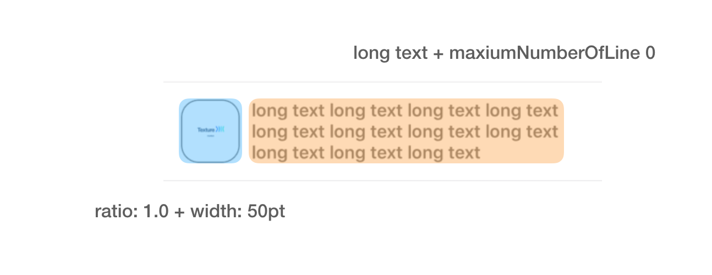
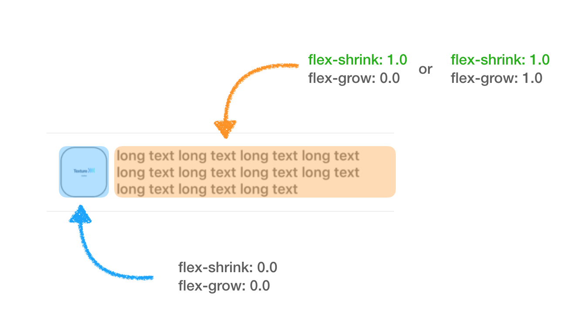
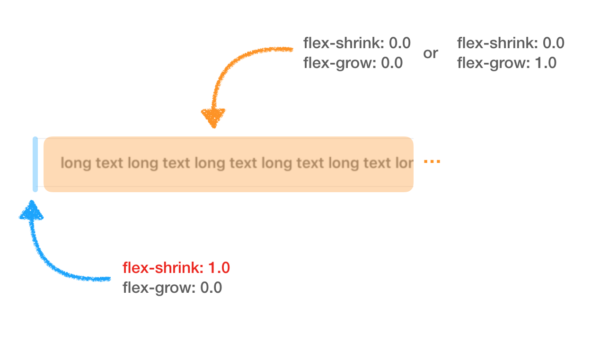
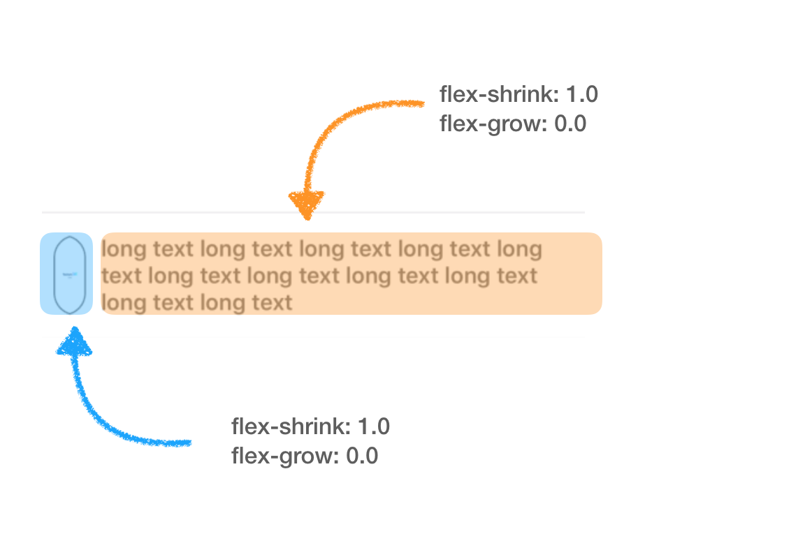
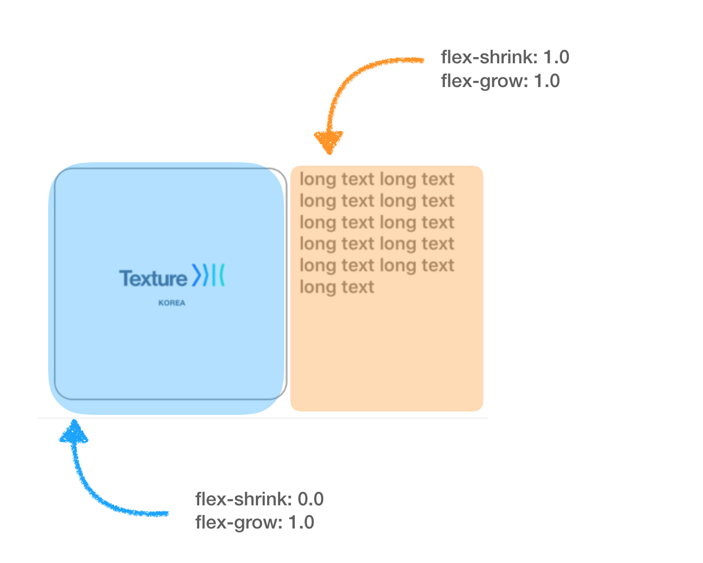
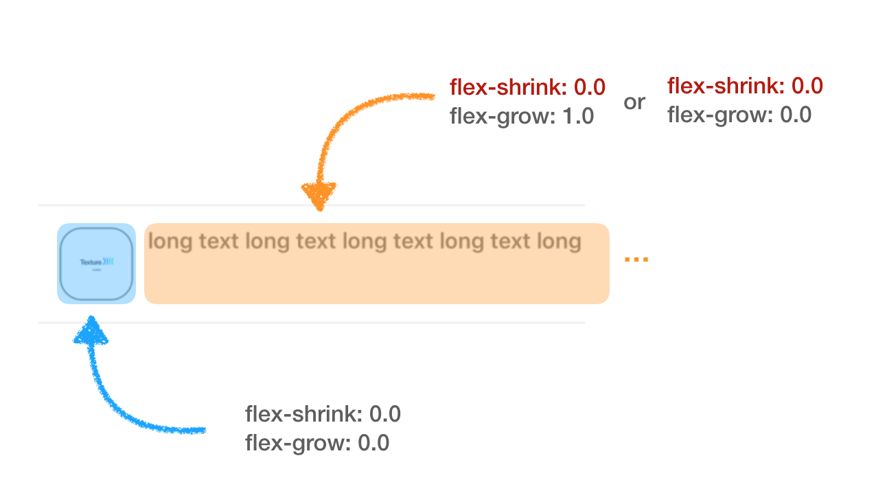
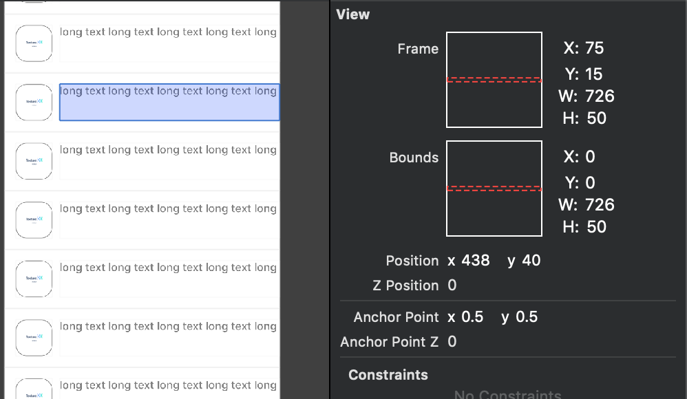

# Flex Box 개념잡기

## Flex Grow & Shrink

**flex-grow**란? 레이아웃의 **증가 너비 비율**을 지정합니다. 이와 반대로 f**lex-shrink**는 레이아웃의 **감소 너비 비율**을 지정합니다. 

flex grow 와 shrink에 대한 의미론적 설명은 사실이게 끝입니다만 현실은 그렇지 않습니다. 

그래서 Newbie들이 이해하기 쉽게 이해하기 위해 아래의 예시를 준비해봤습니다. 



저희는 위의 사진과 같은 image view와 text view를 horizontal 하게 [stackLayout](https://texture-kr.gitbook.io/wiki/layout-api/layoutspecs#3-asstacklayoutspec)으로 배치 할껍니다. 

이미지는 1.0 ratioLayout 으로 배치되어 있으며 [width](https://texture-kr.gitbook.io/wiki/layout-api/layout-element-properties#2-basic-layout-element-properties)값은 50pt로 지정했습니다. 

그리고 text는 라인수 제한이 없으며 \(maxiumNumberOfLine == 0\) 최대한 긴 text로 준비했습니다. 

[layout elements properties 에 대해서 더 알아보기 ](https://texture-kr.gitbook.io/wiki/layout-api/layout-element-properties)

```swift
override func layoutSpecThatFits(_ constrainedSize: ASSizeRange) -> ASLayoutSpec {
    let imageRatioLayout = ASRatioLayoutSpec(ratio: 1.0, child: imageNode)
    imageRatioLayout.style.width = .init(unit: .points, value: 50.0)
        
    imageRatioLayout.style.flexShrink = 0.0 // TODO
    imageRatioLayout.style.flexGrow = 0.0 // TODO
    titleNode.style.flexShrink = 0.0 // TODO
    titleNode.style.flexGrow = 0.0 // TODO
       
    let containerLayout = ASStackLayoutSpec(direction: .horizontal,
                                            spacing: 10.0,
                                            justifyContent: .start,
                                            alignItems: .stretch,
                                            children: [imageRatioLayout, titleNode])
        
    return ASInsetLayoutSpec(insets: .zero, child: containerLayout)
}
```

그리고 image ratio layout과 text view에 flex shrink와 grow값을 여러케이스로 나눠서 1 or 0으로 지정했을 때 어떠한 모습으로 그려질 지 여러 케이스로 나눠봤습니다.

_fraction은 쓰지않고 shrink과 grow을 제어할 예정이기 때문에 아주 쉽게 **1은 활성화**, **0은 비활성화**로 이해하도록합시다._ 

\_\_

### 1. non-grow/non-shrink + shrink



_위와 같은 모습이 가장 이상적인 형태의 UI 모습입니다._ 

_좌측 레이아웃은 이미 width값이 정해졌기 때문에 shrink와 grow은 의미가 없어 보입니다._ 

_하지만 우측레이아웃의 경우 길이가 긴상황이지만_ 

_**shrink를 활성화** 시켰기 때문에_ 

_끝없이 **늘어나지 않는 모습**을 볼 수 있습니다._

\_\_

한계가 없을 정도로  사이즈가 큰 어떠한 레이아웃이더라도 **shrink**를 걸면 _미친?듯이_ **자라나지 못하도록 막습니다**.

* 사이즈가 예측 불가능한 우측레이아웃이 더 이상 자라나지 못하도록 shrink를 걸어주는게 포인트 입니다. 


### 2. non-grow/shrink + non-shrink



**좌측** 레이아웃이 **shrink**가 걸린 상황에다 

**우측** 레이아웃이 **non-shrink**\(shrink 제약이 없는\) 상황에선 

우측 레이아웃은 자신의 사이즈에 맞춰서 랜더링 되기 때문에

좌측 레이아웃이 shrink 됌으로써 희생되는 상황입니다. __

* non-grow에 shrink제약 걸린 좌측 레이아웃이 shrink제약 없는 우측 레이아웃에 밀려납니다. 
* 측이 grow든 non-grow든 상관 없이 측이 공간을 가장많이 차지하게 됩니다. 

### 

### 3. 경쟁상태 \(동등한 flex 값\) 



이건 정말 웃지못할 상황입니다. 

보시면 좌/우측 둘 다 **동등하게** shrink가 걸린 상황에 non-grow로 되어 있습니다. 

이런 상황에선 부모위의 자식 레이아웃들은 서로 **경쟁**을 하게되는 상황에 놓이게 되며 

**최대한 성장할 수 있는 레이아웃이 가장 크게 성장합니다.** ~~_세상이 다 그렇습니다. 더러운 약육강식의 세계_~~ 

* shrink, grow 값 상관없이 동일한 값으로 정의된 자식 레이아웃들은 서로 경쟁합니다. 
* 양측 다 동일한 사이즈면 1:1 동등하게 자리잡습니다. 

~~\_\_~~

### 

### 4. 양측 다 Grow상태에서 한쪽은 non-shrink고 반대는 shrink 걸린 상황 



* **grow**값이 **동일**하기 때문에 **동등한 비율**을 가집니다. 
* 좌측은 shrink가 걸리지 않았기 때문에 지정한 사이즈보다 커집니다. 


### 5. 양측 다 non-shrink상태인 경우





* 둘 다 shrink에 제약이 없습니다. 둘 다 자신의 사이즈에 맞게 레이아웃을 배치 합니다. 
* 좌측은 non-grow이기 때문에 자신의 사이즈에 맞춰서 레이아웃을 배치합니다. 
* 우측은 grow던 non-grow던 자신의 사이즈가 크기 때문에 스크린을 벗어나는 레이아웃을 배치합니다. 


## justifyContent & alignItems

