# Flex Box

## Flex Grow & Shrink

**flex-grow**란? 레이아웃의 **증가 너비 비율**을 지정합니다. 이와 반대로 f**lex-shrink**는 레이아웃의 **감소 너비 비율**을 지정합니다.

둘 다 공간에 대해서 비율을 지정하는 프로퍼티이지만 다른 점은 

**flex-grow**의 경우 전체에서 남는 공간에 대해서 비율에 따라 배분을 받습니다. 

예를 들어 부모 레이아웃에 자식들이 grow가 0.2, 0.3, 0.5 로 정의 되어 있다면 전체가 1 \(0.2 + 0.3 + 0.5\) 이고 각 자식들은 20% \(0.2 / 1.0\),  30% \(0.3 / 1.0\), 50% \(0.5 / 1.0\) 의 비율로 너비 비율 및 공간을 배치하게 됩니다. 


반대로 **flex-shrink**의 경우 부모 레이아웃 상에서 자식 자신의 크기에 비해 공간이 모자랄 때 자신의 크기를 제한하는 비율을 정합니다. 

예를 들어 부모 레이아웃에 자식들이 각각 grow가 0이고 shrink가 1이며 동일하게 부모레이아웃 사이즈를 초과할 정도의 큰 사이즈를 가지고 있다고 가정했을 때 동등하게 비율을 가지게 됩니다. 


여기서 1번 자식이 shrink 를 0.5로 제약 비율을 줄이면 아래의 사진과 같이 1번 자식이 공간을 더 차지하게 되고 2, 3번 자식은 같은 shrink값을 가지기 때문에 동등한 사이즈를 할당받게 됩니다. 

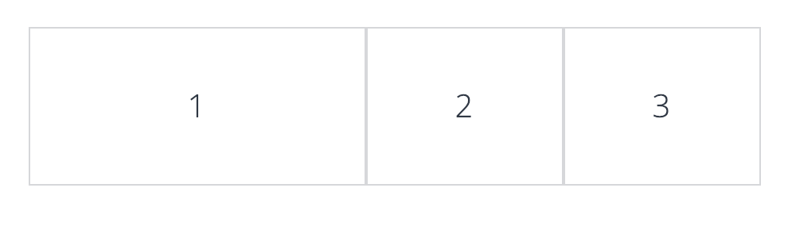

만약 자식들의 사이즈 총합이 부모보다 작을 경우에는 어떻게 될까요? 

자식들의 사이즈는 동일하고, 총합이 부모보다 작을 경우를 그려낸다면 다음과 같이 나옵니다. 

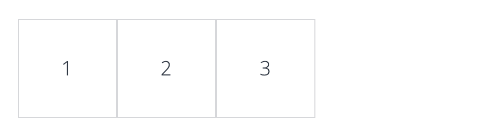

grow가 0이기 때문에 늘어날 이유도 없을 뿐더러 **shrink 비율은 무의미**해지는 것이 핵심입니다. 

사이즈를 다르게 해도 마찬가지입니다. 

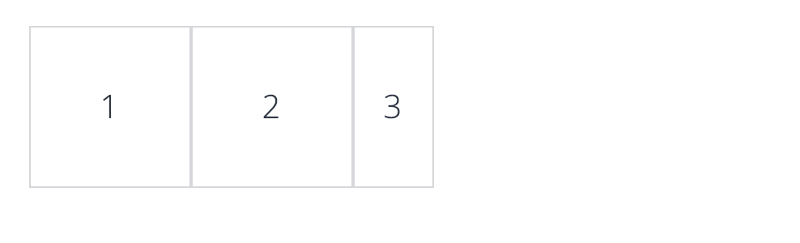

 

여기까지 이해가 되지 않으시다면 [여기](https://yogalayout.com/)를 클릭해주세요. 


Texture를 사용하는 개발자들을 위해서 좀 더 친숙하게 Texture Layout API를 기반으로 예시를 준비해봤습니다. 


저희는 위의 사진과 같은 image view와 text view를 horizontal 하게 [stackLayout](https://texture-kr.gitbook.io/wiki/layout-api/layoutspecs#3-asstacklayoutspec)으로 배치 할껍니다. 

이미지는 1.0 ratioLayout 으로 배치되어 있으며 [width](https://texture-kr.gitbook.io/wiki/layout-api/layout-element-properties#2-basic-layout-element-properties)값은 50pt로 지정했습니다. 

그리고 text는 라인수 제한이 없으며 \(maxiumNumberOfLine == 0\) 최대한 긴 text로 준비했습니다. 

[layout elements properties 에 대해서 더 알아보기 ](https://texture-kr.gitbook.io/wiki/layout-api/layout-element-properties)

```swift
override func layoutSpecThatFits(_ constrainedSize: ASSizeRange) -> ASLayoutSpec {
    let imageRatioLayout = ASRatioLayoutSpec(ratio: 1.0, child: imageNode)
    imageRatioLayout.style.width = .init(unit: .points, value: 50.0)
        
    imageRatioLayout.style.flexShrink = 0.0 // TODO
    imageRatioLayout.style.flexGrow = 0.0 // TODO
    titleNode.style.flexShrink = 0.0 // TODO
    titleNode.style.flexGrow = 0.0 // TODO
       
    let containerLayout = ASStackLayoutSpec(direction: .horizontal,
                                            spacing: 10.0,
                                            justifyContent: .start,
                                            alignItems: .stretch,
                                            children: [imageRatioLayout, titleNode])
        
    return ASInsetLayoutSpec(insets: .zero, child: containerLayout)
}
```

그리고 image ratio layout과 text view에 flex shrink와 grow값을 여러케이스로 나눠서 1 or 0으로 지정했을 때 어떠한 모습으로 그려질 지 여러 케이스로 나눠봤습니다.

_fraction은 쓰지않고 shrink과 grow을 제어할 예정이기 때문에 아주 쉽게 **1은 활성화**, **0은 비활성화**로 이해하도록합시다._ 

\_\_

### 1. non-grow/non-shrink + shrink


_위와 같은 모습이 가장 이상적인 형태의 UI 모습입니다._ 

_좌측 레이아웃은 이미 width값이 정해졌기 때문에 shrink와 grow은 의미가 없어 보입니다._ 

_하지만 우측레이아웃의 경우 길이가 긴상황이지만_ 

_**shrink를 활성화** 시켰기 때문에_ 

_끝없이 **늘어나지 않는 모습**을 볼 수 있습니다._

\_\_

한계가 없을 정도로  사이즈가 큰 어떠한 레이아웃이더라도 **shrink**를 걸면 _미친?듯이_ **자라나지 못하도록 막습니다**.

* 사이즈가 예측 불가능한 우측레이아웃이 더 이상 자라나지 못하도록 shrink를 걸어주는게 포인트 입니다. 


### 2. non-grow/shrink + non-shrink


**좌측** 레이아웃이 **shrink**가 걸린 상황에다 

**우측** 레이아웃이 **non-shrink**\(shrink 제약이 없는\) 상황에선 

우측 레이아웃은 자신의 사이즈에 맞춰서 랜더링 되기 때문에

좌측 레이아웃이 shrink 됌으로써 희생되는 상황입니다. __

* non-grow에 shrink제약 걸린 좌측 레이아웃이 shrink제약 없는 우측 레이아웃에 밀려납니다. 
* 우측이 grow든 non-grow든 상관 없이 shrink 제약이 없기 때문에 공간을 가장많이 차지하게 됩니다. 

### 

### 3. 경쟁상태 \(동등한 flex 값\) 


이건 정말 웃지못할 상황입니다. 

보시면 좌/우측 둘 다 **동등하게** shrink가 걸린 상황에 non-grow로 되어 있습니다. 

이런 상황에선 부모위의 자식 레이아웃들은 서로 **경쟁**을 하게되는 상황에 놓이게 되며 

**최대한 성장할 수 있는 레이아웃이 가장 크게 성장합니다.** ~~_세상이 다 그렇습니다. 더러운 약육강식의 세계_~~ 

* shrink, grow 값 상관없이 동일한 값으로 정의된 자식 레이아웃들은 서로 경쟁합니다. 
* 양측 다 동일한 사이즈면 1:1 동등하게 자리잡습니다. 

~~\_\_~~

### 

### 4. 양측 다 Grow상태에서 한쪽은 non-shrink고 반대는 shrink 걸린 상황 


* **grow**값이 **동일**하기 때문에 **동등한 비율**을 가집니다. 
* 좌측은 shrink가 걸리지 않았기 때문에 지정한 사이즈보다 커집니다. 


### 5. 양측 다 non-shrink상태인 경우


* 둘 다 shrink에 제약이 없습니다. 둘 다 자신의 사이즈에 맞게 레이아웃을 배치 합니다. 
* 좌측은 non-grow이기 때문에 자신의 사이즈에 맞춰서 레이아웃을 배치합니다. 
* 우측은 grow든 non-grow던 자신의 사이즈가 크기 때문에 스크린을 벗어나는 레이아웃을 배치합니다. 


## justifyContent & alignItems

### 1. justifyContent

justifyContent는 layout의 주축으로 부터 children elements의 배치 방법을 의미합니다.

종류는 다음과 같이 총 5가지로 나눠집니다.  

* start 
* center
* end
* spaceBetween
* spaceAround

#### start \(ASStackLayoutJustifyContentStart\)

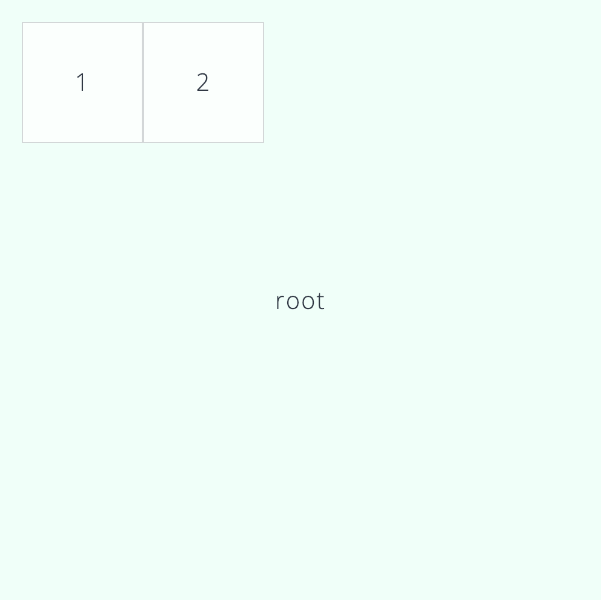

layout상에서 좌측\(start\)을 기준으로 children elements를 배치합니다.


#### center \(ASStackLayoutJustifyContentCenter\)

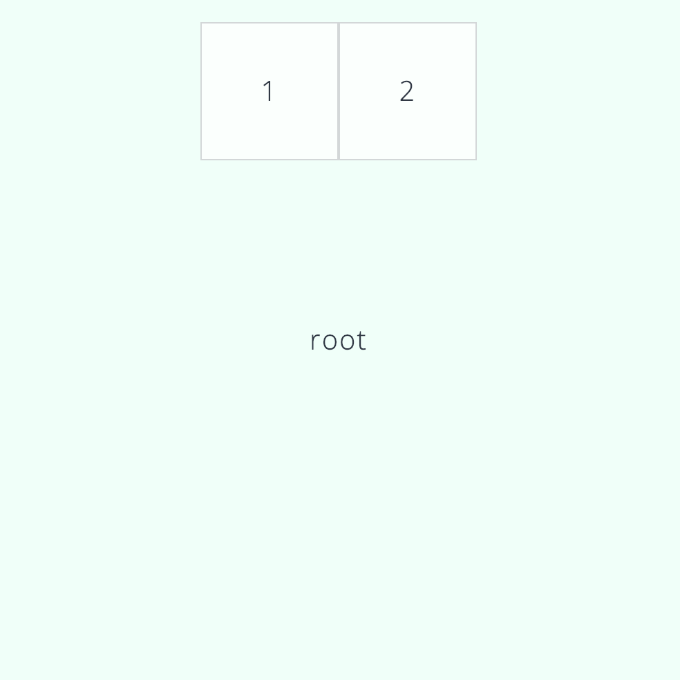

가운데를 기준으로 children elements를 배치합니다. 


#### end \(ASStackLayoutJustifyContentEnd\)


layout상에서 start와 반대로 우측\(end\)을 기준으로 children elements를 배치합니다.


#### spaceBetween \(ASStackLayoutJustifySpaceBetween\)


**children elements간에 간격을 동일하게 유지한 상태**로 **분산 배치**합니다. 만약 children이 3개 이상일 경우엔 다음과 같이 배치됩니다. 

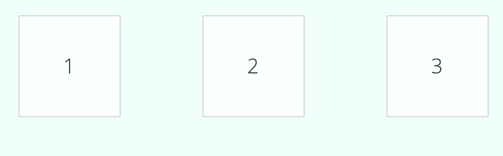

_children elements간에 일정한 간격을 유지하면서 분산 배치를 하되 홀수개 이므로 2번 자식이 가운데에 배치되는 걸 확인 하실 수가 있습니다._ 


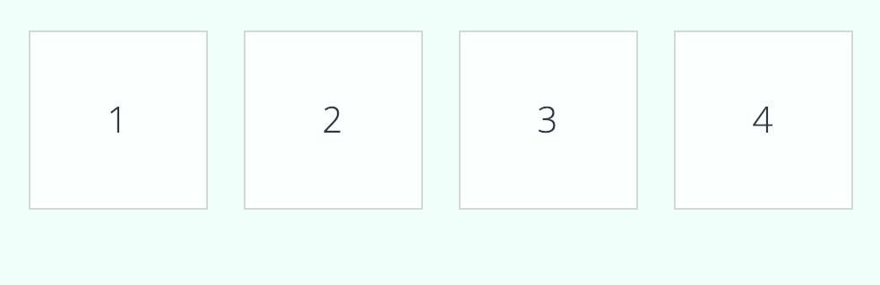

_앞서 말했듯이 일정한 간격을 유지하는 것을 볼 수 있습니다._ 


#### spaceAround \(ASStackLayoutJustifySpaceAround\)

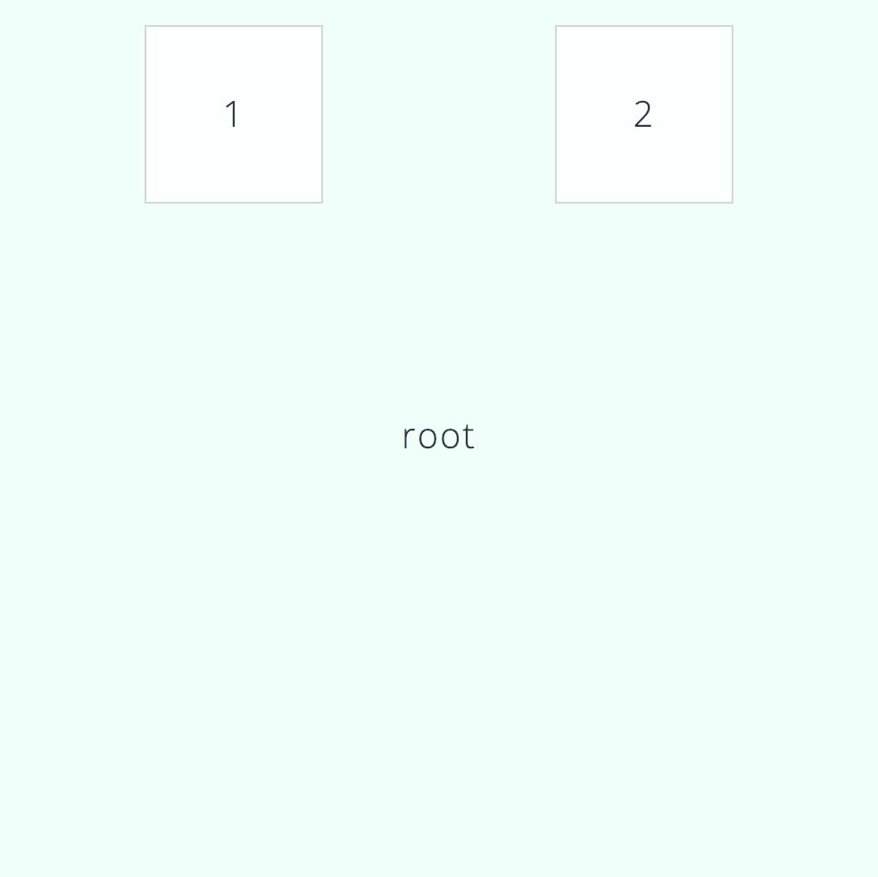

spaceBetween이랑 유사하게 보일 수 있으나 가장 큰 차이점은 **자식의 주위에 대해서 동일한 간격**을 유지한 상태로 일정하게 배치합니다. 

### 2. alignItems

Stack상에서 child layout elements이 차지하는 공간의 위치에 대한 정렬을 의미합니다. 

#### start \(ASStackLayouotAlignItemsStart\)

기본값으로 Stack의 주축 방향을 기준으로 시작점에 배치시킵니다.

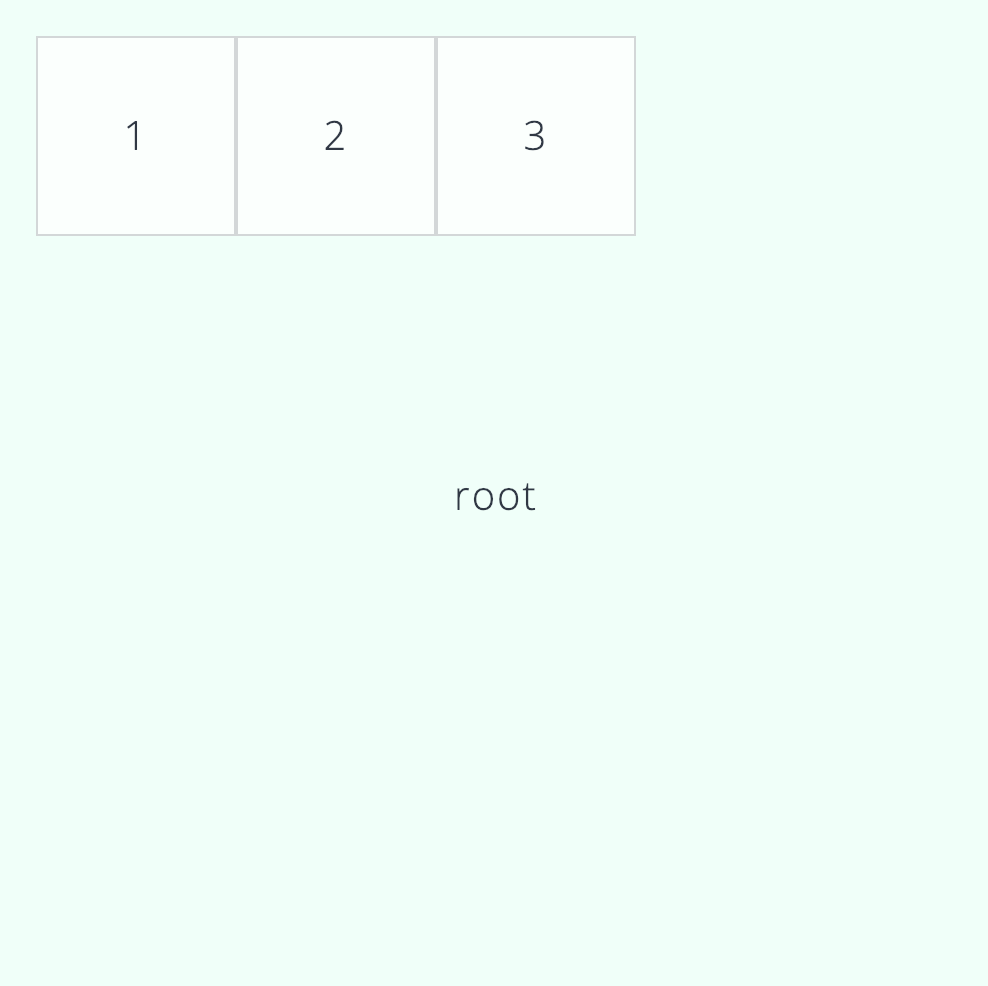

#### end \(ASStackLayouotAlignItemsEnd\)

Stack의 주축 방향을 기준으로 점에 배치시킵니다.

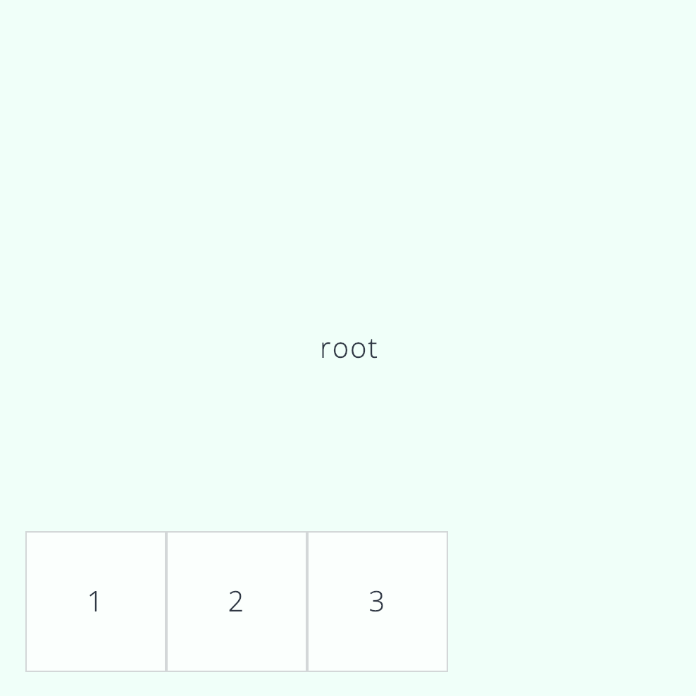

#### center \(ASStackLayouotAlignItemsCenter\)

Stack의 주축 방향을 기준으로 가운데에 배치시킵니다. 

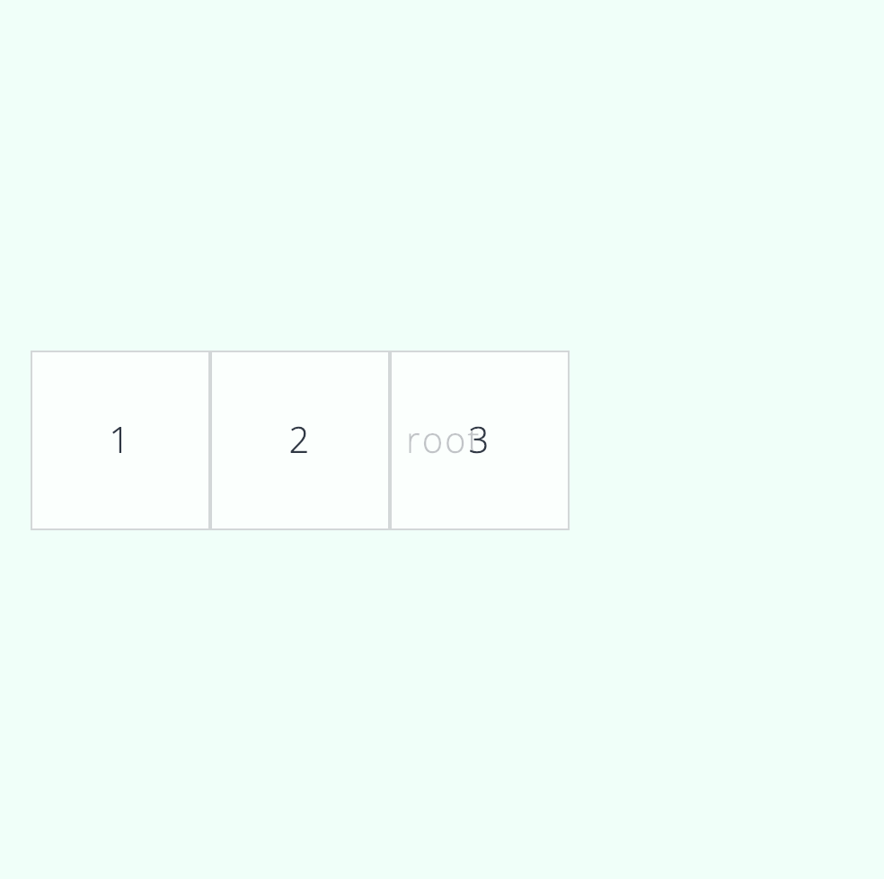

#### stretch \(ASStackLayouotAlignItemsStretch\)

Stack의 주축 방향을 기준으로 최대 크기로 채웁니다.

* **최대 크기 또는 고정크기**가 정의되어 있으면 **최대크기 또는 고정크기 만큼 사이즈**를 결정합니다.  
* 최대 또는 고정 **크기가 정의 되어 있지않거나 최소 크기만 정의** 되어 있다면 **부모의 사이즈만큼** 채우게 됩니다. 

예를 들어 1,2,3 child layout element가 있고 2, 3은 N x N 의 고정크기를 갖고 1은 width N과 minimum height N값을 가지고 있다고 가정해봅시다.

2, 3은 고정크기를 갖기 때문에 stretch가 적용되더라고 고정크기 만큼 사이즈가 결정됩니다.

하지만 1의 경우 최대높이 또는 고정높이가 정의되어 있지 않기 때문에 부모\(root\)의 높이 만큼 높이가 늘어나게 됩니다. 

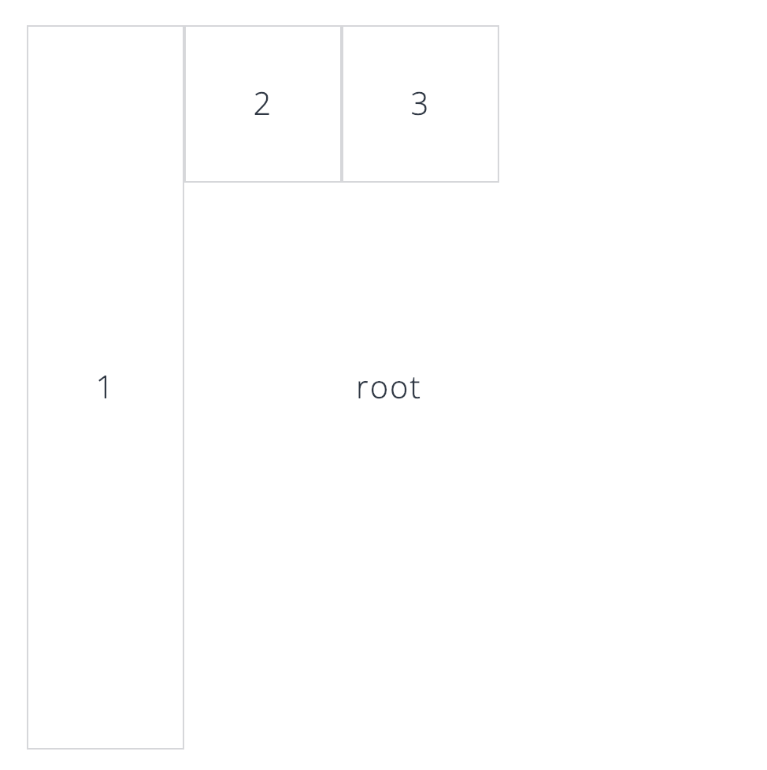

#### baselineFirst \(ASStackLayouotAlignItemsBaselineFirst\)

Stack의 주축 방향을 기준으로 **첫번째 위치한 layout element의 baseline**에 맞추어 배치합니다. 

예를 들어 3개의 사이즈가 서로다른 child layout elements가 있다고 가정하고 alignItems을 start로 정의하면 아래의 이미지와 같이 배치될껍니다.

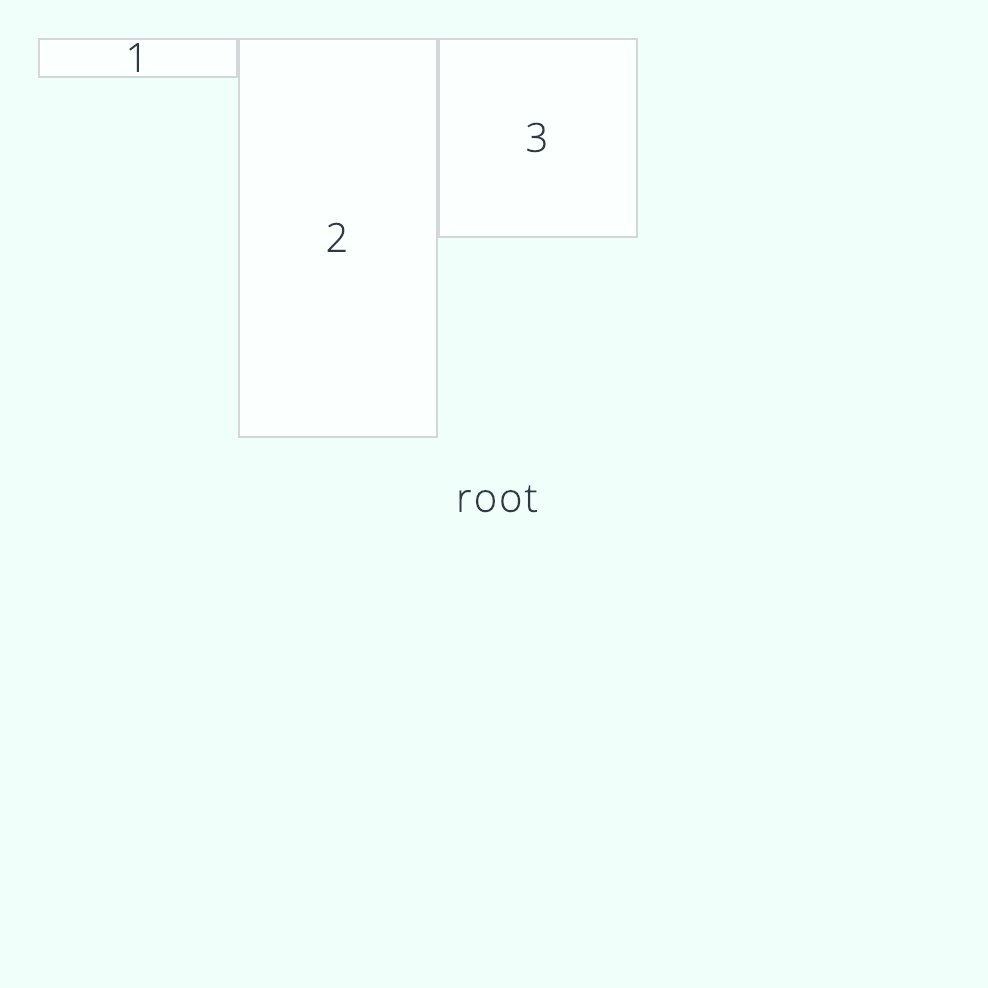

1, 2, 3은 앞서 설명한 alignItem start의 설명과 같이 처리되는 것을 볼 수가 있습니다. 

여기서 baselineFirst로 alignItem을 설정하게 되면 **1번 layout elements의 바닥부분\(baseline\)을 기준**으로 나머지 layout elements이 아래의 사진과 같이 배치되게 됩니다. 

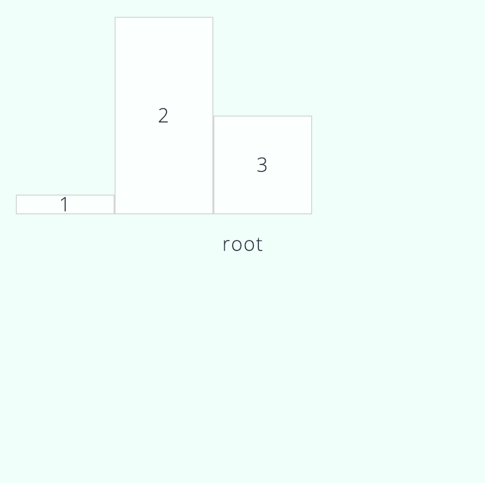


#### baselineLast \(ASStackLayouotAlignItemsBaselineLast\)

Stack의 주축 방향을 기준으로 **마지막에 위치한 layout element의 baseline**에 맞추어 배치합니다. 


#### notSet \(ASStackLayouotAlignItemsNotSet\)

어떠한 설정을 하지않습니다. child layout elements의 각각의 align-self 설정값에 따라 child layout element를 배치합니다. 

예를 들어 1, 2, 3 의 layout element가 있다고 가정했을 때 

1번의 align-self을 start

2번의 align-self을 center 

3번의 align-self을 end로 정의하면 아래의 이미지와 같이 배치됩니다.

```swift
let node1 = ASDisplayNode()
let node2 = ASDisplayNode()
let node3 = ASDisplayNode()

node1.style.alignSelf = .start
node2.style.alignSelf = .center
node3.style.alignSelf = .end

// ...
```

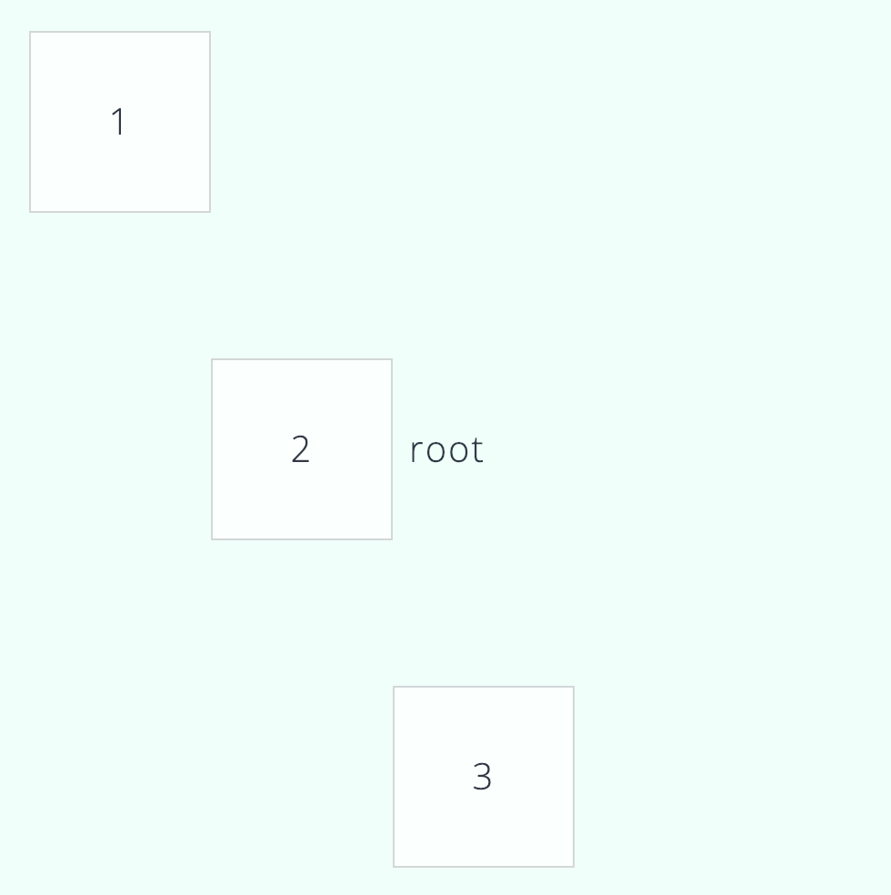


