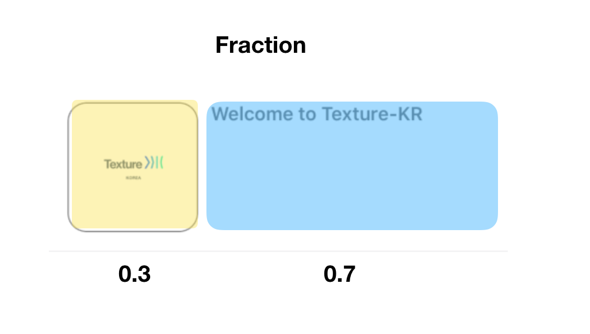

# Quick Example

## 1. Single Screen Example


### 1. ViewController에서 Component를 정의 및 사용하는 경우  

ViewController의 부모노드에 들어갈 자식 노드를 정의해서 사용하는 방법입니다. 비즈니스 로직이나 명세에 따라서 복잡도가 증가할수록 Massive 해질 수도 있습니다. 

```swift
final class TestNodeController: ASDKViewController<ASDisplayNode> {

  // MARK: UI
  
  private let imageNode: ASImageNode = {
    let node = ASImageNode()
    node.image = UIImage(named: "image")
    node.borderColor = UIColor.gray.cgColor
    node.borderWidth = 1.0
    node.cornerRadius = 15.0
    node.contentMode = .scaleAspectFit
    return node
  }()

  private let titleNode: ASTextNode = {
    let node = ASTextNode()
    let paragraphStyle = NSMutableParagraphStyle()
    paragraphStyle.alignment = .center
    node.attributedText = NSAttributedString(
      string: "Welcome to Texture-KR",
      attributes: [
        .font: UIFont.boldSystemFont(ofSize: 15.0),
        .foregroundColor: UIColor.gray,
        .paragraphStyle: paragraphStyle
      ]
    )
    return node
  }()
  
  
  // MARK: Initializing

  override init() {
    super.init(node: ASDisplayNode())
    self.node.backgroundColor = .white
    self.node.automaticallyManagesSubnodes = true
    self.node.automaticallyRelayoutOnSafeAreaChanges = true
    self.node.layoutSpecBlock = { [weak self] (node, constraintedSize) -> ASLayoutSpec in
      return self?.layoutSpecThatFits(constraintedSize) ?? ASLayoutSpec()
    }
  }

  required init?(coder aDecoder: NSCoder) {
    fatalError("init(coder:) has not been implemented")
  }
  
  
  // MARK: Layout

  private func layoutSpecThatFits(_ constraintedSize: ASSizeRange) -> ASLayoutSpec {
    var containerInsets: UIEdgeInsets = self.node.safeAreaInsets
    containerInsets.left += 15.0
    containerInsets.right += 15.0
    containerInsets.top = containerInsets.bottom
    return ASInsetLayoutSpec(
      insets: containerInsets,
      child: self.contentLayoutSpec()
    )
  }

  private func contentLayoutSpec() -> ASLayoutSpec {
    return ASStackLayoutSpec(
      direction: .vertical,
      spacing: 10.0,
      justifyContent: .center,
      alignItems: .center,
      children: [
        self.imageLayoutSpec(),
        self.titleNode
      ]
    )
  }

  private func imageLayoutSpec() -> ASLayoutSpec {
    return ASRatioLayoutSpec(ratio: 1.0, child: self.imageNode).styled {
      $0.flexShrink = 1.0
    }
  }
}
```

### 2. Container에 들어갈 노드를 Subclass 화 시켜서 넣어주기. \(Avoid Massive ViewController\) 

[앞서 설명했듯이](https://texture-kr.gitbook.io/wiki/newbie-guide/node#1-texture-node-container-viewcontroller) ASViewController는 제네릭형태로 ASDisplayNode의 모든 Subclass를 받아서 사용할 수 있습니다.

따라서 아래의 코드와 같이 ViewController에 들어간 화면 구성요소들을 모듈화 시켜서 **ViewController가 Massive**해지는 것을 피할 수도 있습니다. 

#### TestNode.swift

```swift
final class TestNode: ASDisplayNode {

  // MARK: UI
  
  private let imageNode: ASImageNode = {
    let node = ASImageNode()
    node.image = UIImage(named: "image")
    node.borderColor = UIColor.gray.cgColor
    node.borderWidth = 1.0
    node.cornerRadius = 15.0
    node.contentMode = .scaleAspectFit
    return node
  }()

  private let titleNode: ASTextNode = {
    let node = ASTextNode()
    let paragraphStyle = NSMutableParagraphStyle()
    paragraphStyle.alignment = .center
    node.attributedText = NSAttributedString(
      string: "Welcome to Texture-KR",
      attributes: [
        .font: UIFont.boldSystemFont(ofSize: 15.0),
        .foregroundColor: UIColor.gray,
        .paragraphStyle: paragraphStyle
      ]
    )
    return node
  }()
  
  
  // MARK: Initializing

  override init() {
    super.init()
    self.automaticallyManagesSubnodes = true
    self.automaticallyRelayoutOnSafeAreaChanges = true
  }
  
  
  // MARK: Node Life Cycle

  override func layout() {
    super.layout()
    self.imageNode.cornerRadius = 15.0
  }
  
  
  // MARK: Layout

  override func layoutSpecThatFits(_ constraintedSize: ASSizeRange) -> ASLayoutSpec {
    var containerInsets: UIEdgeInsets = self.safeAreaInsets
    containerInsets.left += 15.0
    containerInsets.right += 15.0
    containerInsets.top = containerInsets.bottom

    return ASInsetLayoutSpec(
      insets: containerInsets,
      child: self.contentLayoutSpec()
    )
  }

  private func contentLayoutSpec() -> ASLayoutSpec {
    return ASStackLayoutSpec(
      direction: .vertical,
      spacing: 10.0,
      justifyContent: .center,
      alignItems: .center,
      children: [
        self.imageLayoutSpec(),
        self.titleNode
      ]
    )
  }

  private func imageLayoutSpec() -> ASLayoutSpec {
    return ASRatioLayoutSpec(ratio: 1.0, child: self.imageNode).styled {
      $0.flexShrink = 1.0
    }
  }
}
```

#### TestNodeController.swift

```swift
final class TestNodeController: ASDKViewController<TestNode> {

  // MARK: Initializing
  
  override init() {
    super.init(node: TestNode())
    self.node.backgroundColor = .white
  }

  required init?(coder aDecoder: NSCoder) {
    fatalError("init(coder:) has not been implemented")
  }
}
```

## 2. List Screen Example 

[앞서 설명했듯이](https://texture-kr.gitbook.io/wiki/newbie-guide/node#1-texture-node-container-viewcontroller) ASViewController는 제네릭형태로 ASDisplayNode의 모든 Subclass를 받아서 사용할 수 있습니다. ASTableNode는 ASDisplayNode의 subclass이므로 ASViewController를 만들때 **ASVIewController&lt;ASTableNode&gt;** 를 상속받아 ViewController를 만듭니다. 




#### TestCellNode.swift

```swift
final class TestCellNode: ASCellNode {

  // MARK: UI

  private let imageNode: ASImageNode = {
    let node = ASImageNode()
    node.image = UIImage(named: "image")
    node.borderColor = UIColor.gray.cgColor
    node.borderWidth = 1.0
    node.contentMode = .scaleAspectFit
    return node
  }()

  private let titleNode: ASTextNode = {
    let node = ASTextNode()
    node.maximumNumberOfLines = 1
    return node
  }()


  // MARK: Initializing

  init(item: String) {
    super.init()
    self.automaticallyManagesSubnodes = true
    self.selectionStyle = .none
    self.backgroundColor = .white
    self.titleNode.attributedText = NSAttributedString(
      string: item,
      attributes: [
        .font: UIFont.boldSystemFont(ofSize: 15.0),
        .foregroundColor: UIColor.gray
      ]
    )
  }


  // MARK: Node Life Cycle

  override func layout() {
    super.layout()
    self.imageNode.cornerRadius = 15.0
  }


  // MARK: Layout

  override func layoutSpecThatFits(_ constrainedSize: ASSizeRange) -> ASLayoutSpec {
    return ASInsetLayoutSpec(
      insets: UIEdgeInsets(top: 15.0, left: 15.0, bottom: 15.0, right: 15.0),
      child: self.contentLayoutSpec()
    )
  }

  private func contentLayoutSpec() -> ASLayoutSpec {
    return ASStackLayoutSpec(
      direction: .horizontal,
      spacing: 10.0,
      justifyContent: .start,
      alignItems: .stretch,
      children: [
        self.imageLayoutSpec().styled {
          $0.flexBasis =  ASDimension(unit: .fraction, value: 0.3)
        },
        self.titleNode.styled {
          $0.flexBasis =  ASDimension(unit: .fraction, value: 0.7)
        }
      ]
    )
  }

  private func imageLayoutSpec() -> ASLayoutSpec {
    return ASRatioLayoutSpec(ratio: 1.0, child: self.imageNode)
  }
}
```

#### TestNodeController.swift

```swift
final class TestNodeController: ASDKViewController<ASTableNode> {

  // MARK: Properties

  var items: [String] = [
    "Welcome to Texture-KR",
    "Welcome to Texture-KR",
    "Welcome to Texture-KR, long test!!!!!!!!!!!!!!!!!!!!!!!!!!!!!"
  ]


  // MARK: Initializing

  override init() {
    super.init(node: ASTableNode(style: .plain))
    self.node.backgroundColor = .white
    self.node.dataSource = self
  }

  required init?(coder aDecoder: NSCoder) {
    fatalError("init(coder:) has not been implemented")
  }
}


// MARK: -  ASTableDataSource

extension TestNodeController: ASTableDataSource {

  func numberOfSections(in tableNode: ASTableNode) -> Int {
    return 1
  }

  func tableNode(_ tableNode: ASTableNode, numberOfRowsInSection section: Int) -> Int {
    return items.count
  }

  func tableNode(_ tableNode: ASTableNode, nodeBlockForRowAt indexPath: IndexPath) -> ASCellNodeBlock {
    let item = self.items[indexPath.row]
    return {
      return TestCellNode(item: item)
    }
  }
}
```


