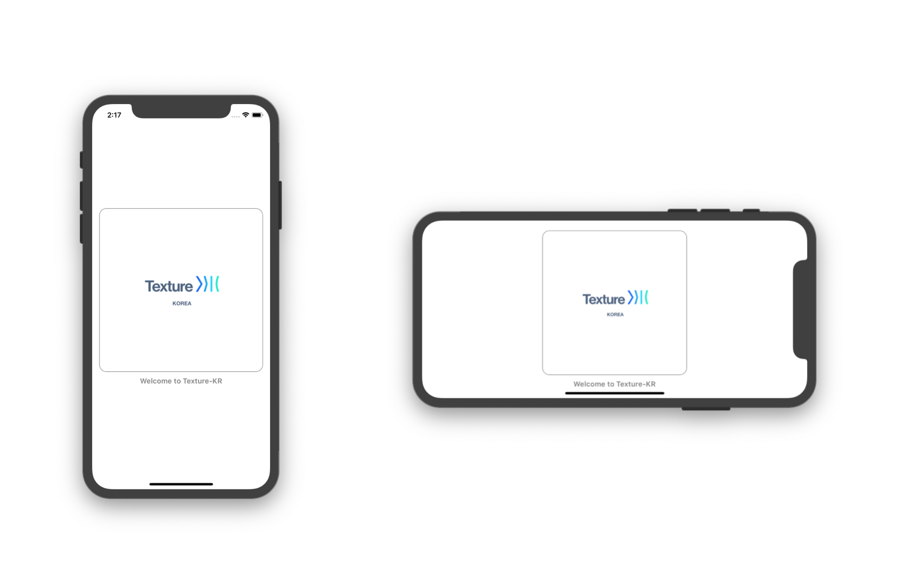
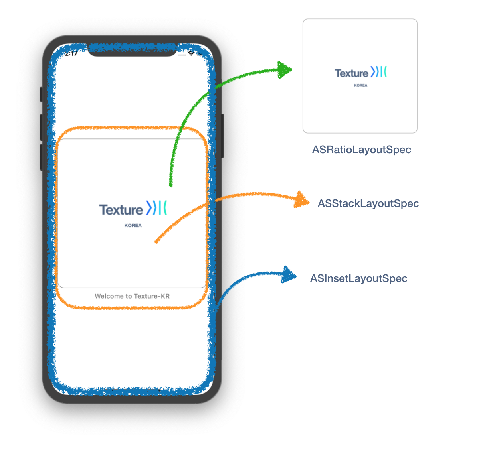

# Quick Example

## 1. Single Screen Example





### 1. ViewController에서 Component를 정의 및 사용하는 경우  

ViewController의 부모노드에 들어갈 자식 노드를 정의해서 사용하는 방법입니다. 비즈니스 로직이나 명세에 따라서 복잡도가 증가할수록 Massive 해질 수도 있습니다. 

```swift
class TestNodeController: ASViewController<ASDisplayNode> {

    let imageNode: ASImageNode = {
        let node = ASImageNode()
        node.image = UIImage(named: "image")
        node.borderColor = UIColor.gray.cgColor
        node.borderWidth = 1.0
        node.cornerRadius = 15.0
        node.contentMode = .scaleAspectFit
        return node
    }()
    
    let titleNode: ASTextNode = {
        let node = ASTextNode()
        let paragraphStyle = NSMutableParagraphStyle()
        paragraphStyle.alignment = .center
        node.attributedText =
            NSAttributedString(string: "Welcome to Texture-KR",
                               attributes: [.font: UIFont.boldSystemFont(ofSize: 15.0),
                                            .foregroundColor: UIColor.gray,
                                            .paragraphStyle: paragraphStyle])
        return node
    }()
    
    init() {
        super.init(node: ASDisplayNode.init())
        self.node.backgroundColor = .white
        self.node.automaticallyManagesSubnodes = true
        self.node.automaticallyRelayoutOnSafeAreaChanges = true
        self.node.layoutSpecBlock = { [weak self] (node, constraintedSize) -> ASLayoutSpec in
            return self?.layoutSpecThatFits(constraintedSize) ?? ASLayoutSpec()
        }
    }
    
    private func layoutSpecThatFits(_ constraintedSize: ASSizeRange) -> ASLayoutSpec {
        let imageRatioLayout = ASRatioLayoutSpec(ratio: 1.0, child: imageNode)
        imageRatioLayout.style.flexShrink = 1.0
        let containerLayout = ASStackLayoutSpec(direction: .vertical,
                                            spacing: 10.0,
                                            justifyContent: .center,
                                            alignItems: .center,
                                            children: [imageRatioLayout, titleNode])
        
        var containerInsets: UIEdgeInsets = self.node.safeAreaInsets
        containerInsets.left += 15.0
        containerInsets.right += 15.0
        containerInsets.top = containerInsets.bottom
        return ASInsetLayoutSpec(insets: containerInsets, child: containerLayout)
    }
    
    required init?(coder aDecoder: NSCoder) {
        fatalError("init(coder:) has not been implemented")
    }
}
```

### 2. Container에 들어갈 노드를 Subclass 화 시켜서 넣어주기. \(Avoid Massive ViewController\) 

[앞서 설명했듯이](https://texture-kr.gitbook.io/wiki/newbie-guide/node#1-texture-node-container-viewcontroller) ASViewController는 제네릭형태로 ASDisplayNode의 모든 Subclass를 받아서 사용할 수 있습니다.

따라서 아래의 코드와 같이 ViewController에 들어간 화면 구성요소들을 모듈화 시켜서 **ViewController가 Massive**해지는 것을 피할 수도 있습니다. 

#### TestNode.swift

```swift
class TestNode: ASDisplayNode {
    
    let imageNode: ASImageNode = {
        let node = ASImageNode()
        node.image = UIImage(named: "image")
        node.borderColor = UIColor.gray.cgColor
        node.borderWidth = 1.0
        node.cornerRadius = 15.0
        node.contentMode = .scaleAspectFit
        return node
    }()
    
    let titleNode: ASTextNode = {
        let node = ASTextNode()
        let paragraphStyle = NSMutableParagraphStyle()
        paragraphStyle.alignment = .center
        node.attributedText =
            NSAttributedString(string: "Welcome to Texture-KR",
                               attributes: [.font: UIFont.boldSystemFont(ofSize: 15.0),
                                            .foregroundColor: UIColor.gray,
                                            .paragraphStyle: paragraphStyle])
        return node
    }()
    
    override init() {
        super.init()
        self.automaticallyManagesSubnodes = true
        self.automaticallyRelayoutOnSafeAreaChanges = true
    }
    
    override func layoutSpecThatFits(_ constraintedSize: ASSizeRange) -> ASLayoutSpec {
        let imageRatioLayout = ASRatioLayoutSpec(ratio: 1.0, child: imageNode)
        imageRatioLayout.style.flexShrink = 1.0
        let containerLayout = ASStackLayoutSpec(direction: .vertical,
                                 spacing: 10.0,
                                 justifyContent: .center,
                                 alignItems: .center,
                                 children: [imageRatioLayout, titleNode])
        
        var containerInsets: UIEdgeInsets = self.safeAreaInsets
        containerInsets.left += 15.0
        containerInsets.right += 15.0
        containerInsets.top = containerInsets.bottom
        
        return ASInsetLayoutSpec(insets: containerInsets, child: containerLayout)
    }
}

```

#### TestNodeController.swift

```swift
class TestNodeController: ASViewController<TestNode> {

    init() {
        super.init(node: TestNode.init())
        self.node.backgroundColor = .white
    }
    
    required init?(coder aDecoder: NSCoder) {
        fatalError("init(coder:) has not been implemented")
    }
}

```

## 2. List Screen Example 


