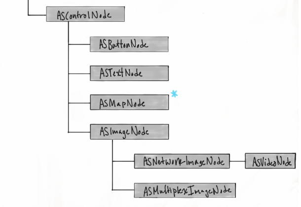

# ASControlNode



ASDisplayNode의 subClass이며, 사용자 인터렉션이 가능한 Node입니다. 

Texture에서 제공되는 `ASButtonNode`, `ASTextNode`, `ASMapNode`, `ASImageNode` 등이 `ASControlNode`를 상속받고 있으며, 기본적으로 제공되는 ASControlNode subclass node이외 custom하게 터치가 가능한 Node를 만들 때 유용합니다.

UIKit의 UIControl과 마찬가지로 기본적인 Event를 아래와 같이 제공해줍니다.

```c
/**
  @abstract Kinds of events possible for control nodes.
  @discussion These events are identical to their UIControl counterparts.
 */
typedef NS_OPTIONS(NSUInteger, ASControlNodeEvent)
{
  /** A touch-down event in the control node. */
  ASControlNodeEventTouchDown         = 1 << 0,
  /** A repeated touch-down event in the control node; for this event the value of the UITouch tapCount method is greater than one. */
  ASControlNodeEventTouchDownRepeat   = 1 << 1,
  /** An event where a finger is dragged inside the bounds of the control node. */
  ASControlNodeEventTouchDragInside   = 1 << 2,
  /** An event where a finger is dragged just outside the bounds of the control. */
  ASControlNodeEventTouchDragOutside  = 1 << 3,
  /** A touch-up event in the control node where the finger is inside the bounds of the node. */
  ASControlNodeEventTouchUpInside     = 1 << 4,
  /** A touch-up event in the control node where the finger is outside the bounds of the node. */
  ASControlNodeEventTouchUpOutside    = 1 << 5,
  /** A system event canceling the current touches for the control node. */
  ASControlNodeEventTouchCancel       = 1 << 6,
  /** A system event triggered when controls like switches, slides, etc change state. */
  ASControlNodeEventValueChanged      = 1 << 12,
  /** A system event when the Play/Pause button on the Apple TV remote is pressed. */
  ASControlNodeEventPrimaryActionTriggered = 1 << 13,
    
  /** All events, including system events. */
  ASControlNodeEventAllEvents         = 0xFFFFFFFF
};
```

#### addTarget

UIControl과 마찬가지로 `addTarget`에 대한 사용법은 동일합니다. 

```swift
let node = ASControlNode()
node.addTarget(target: self, action: #selector(TODO:), for: .touchUpInside)
```


### Hit Test Slop

터치영역을 조절하는 방식으로 두가지가 있습니다. UIKit와 동일하게 `hitTest:withEvent:`method를 override하는 방식과 `hitTestSlop` property를 접근해서 UIEdgeInsets을 negative or positive 값을 적절히 지정하는 방식이 있습니다.

_hitTestSlop property접근을 활용한 조절을 권장합니다._ 

#### 터치영역 늘리기

```swift
let node = ASControlNode()
// negative -> 터치영역 증
node.hitTestSlop = .init(top: -100.0, left: -100.0, bottom: -100.0, right: -100.0)
```

#### 터치영역 줄이

```swift
let node = ASControlNode()
// positive -> 터치영역 감소 
node.hitTestSlop = .init(top: 10.0, left: 10.0, bottom: 10.0, right: 10.0)
```

조절한 Hit Test Slop을 Visualization하는 방법은 [여기](https://texture-kr.gitbook.io/wiki/advanced-guide/debug-tool#hit-test-visualization)를 참고해주세요. 

