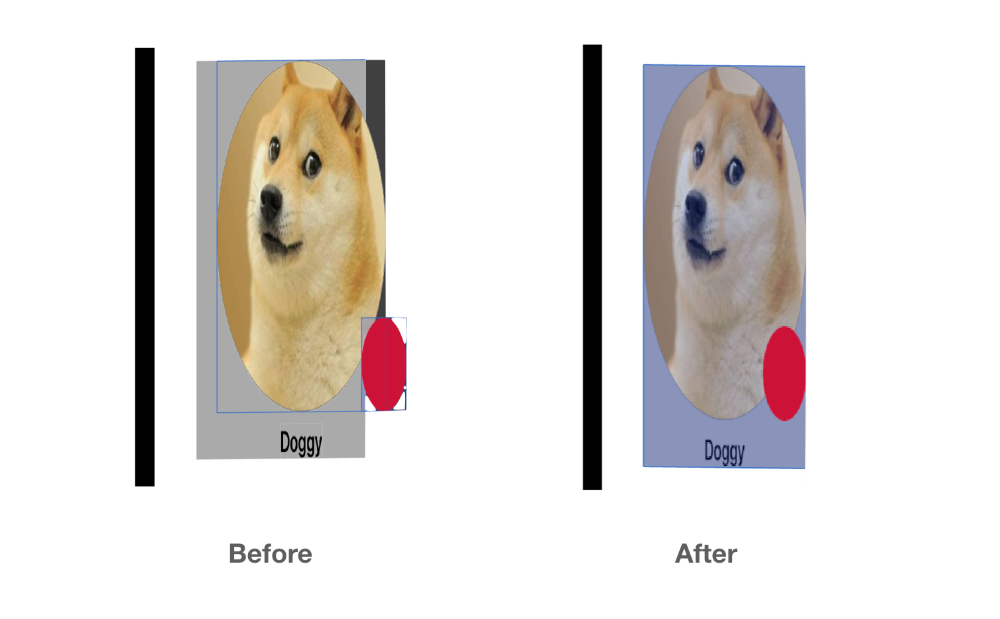

# Layer Backing

어떤 경우에는 뷰 대신 레이어를 사용함으로써 앱의 성능을 향상시킬 수 있습니다. Texture 에서는 Touch Handling 이 필요 없는 Custom Node 를 **layer-backing** 하도록 권장합니다.

UIKit 은 API 의 차이 때문에 뷰 기반 코드를 레이어로 수동 변환하는건 어렵습니다. 더 심각한건, 터치 핸들링 또는 특정 뷰 기능을 활성화할 때 전부 수동으로 변환해야 합니다.

모든 Texture 노드에서 전체 서브 트리를 뷰에서 레이어로 변환하는 작업은 다음과 같이 간단합니다.

```swift
rootNode.isLayerBacked = true
```

다시 돌리려면 위 한 줄을 지우면 됩니다 :D



주의사항으로는 **isLayerBacked가 활성화**된 ASControlNode 및 서브 노드들은 **addTarget:을 사용할 수 없습니다.** \(내부적으로 크래시 일어납니다.\)

하지만 **p7.11 branch** 또는 **2.9** 이후 부터는 사용가능합니다.



